<!-- Bản chuyển từ PDF do người dùng cung cấp; văn bản gốc của bài báo giữ bằng tiếng Anh. -->
> **Bản Markdown của paper:** Các công thức được viết bằng LaTeX; chỉ Hình 1–14 dùng ảnh gốc được nhúng trong PDF. Nguồn: *Scientific Reports* **16**, 26160 (2026), DOI: 10.1038/s41598-026-55955-2.

---

## Trang 1 / Page 1

scientific reports

www.nature.com/scientificreports 

**Check for updates**

## **OPEN** 

# **Risk-sensitive mean-field control of large-scale UAV Swarms for stochastic disaster tracking and robust first response** 

**Mohd Abuzar Sayeed****1,4** **, Mohd Asim Sayeed****2,4** **, Tanveer Ahmed****3** **& Anuj Kumar Bharti****1,4** 

**This paper proposes a risk-sensitive mean field optimal control framework for large-scale multi-UAV disaster tracking, guidance, and first response operations in the presence of stochastic uncertainty and communication limitations. As opposed to existing heuristic, clustering approaches, and swarm-based optimization techniques, which are frequently risk neutral and based on deterministic propagation models, the new approach takes into account the stochastic nature of the disaster field, a risk-sensitive performance function of exponential form, and a modified Riccati recursion. Although the backward Riccati recursion is computed offline in a centralized fashion, the real-time computations become fully distributed, whereby each UAV calculates its own control gain using communication with its neighboring UAVs only. Computational complexity is decoupled from the cardinality of the swarm using a mean-field approximation. In addition, entropy-dual formulation guarantees distribution robustness, which takes into account the worst-case disturbance realizations within a bounded Kullback-Leibler divergence ball, irrespective of, and also complementary to, the distributed online computing structure in which each UAV only interacts with its nearest neighbors. Theoretical results on closed-loop Schur stability, risk-admissibility limits, convergence to a mean-field equilibrium, and consistency of distributed consensus algorithms have been rigorously proved and numerically verified. The simulations carried out on a wide range of urban obstacles have shown that the proposed algorithm performs better compared to other methods in terms of efficiency in coverage, mission time, energy consumption, connectivity preservation, path length, and robustness to increased variances in disturbances. The suggested framework is, to the best knowledge of the authors, the first integrated approach to the problem of risk-sensitive mean-field control, entropy-dual distributionally robust optimization, and communication-constrained distributed consensus in the context of disaster relief operations with UAVs.** 

Time-dependent data acquisition in a catastrophic situation or disaster environment is of paramount importance for facilitating relief, hence reducing financial losses. Certain challenges accompany a disaster situation, and the naturally fragile information infrastructure is impacted, clogged, or even destroyed1–3 . Throughout the course, various strategies like mobile portable communication4 , social media5 , crowd sourcing6 etc. have been proposed to address the problem of vital and consensus data acquisition. The advent of technology and the introduction of multi-UAV data dissemination techniques have made aerial vehicles an ideal solution for data collection, navigation, and guidance under disaster scenarios. Recent examples include the 2021 Henan flash flood7 , and the 2022 Luding earthquake8,9 . For clarity, the main abbreviations used throughout the manuscript are summarized in Table 1. 

Collaborative UAV data collection, mapping, and guidance can be traced back to more general everyday applications like communication infrastructure10,11 , assisted ground networks12,13 , construction and infrastructure14,15 . Generalized applications of UAV assisted data assimilation have driven aerial deployments towards assisted catastrophe relief. UAVs offer numerous benefits, including great flexibility and speed, cost 

1School of Computer Science Engineering and Technology, Bennett University, Gautam Buddha Nagar 201310, India.2 School of Computer Applications, Babu Banarasi Das University, Lucknow 226028, India.3 Symbiosis Institute of Technology, Symbiosis International (Deemed University), Pune 412115, India.4 Mohd Abuzar Sayeed, Mohd Asim Sayeed and Anuj Kumar Bharti contributed equally: Mohd Abuzar Sayeed, Mohd Asim Sayeed, Tanveer Ahmed, and Anuj Kumar Bharti. email: tanveer.ahmed@sitpune.edu.in 

**Scientific Reports** |        (2026) 16:26160 

1 

| https://doi.org/10.1038/s41598-026-55955-2

---

## Trang 2 / Page 2

|**Abbreviation**|**Meaning**|
|---|---|
|UAV|Unmanned Aerial Vehicle|
|MUAV|Multi-Unmanned Aerial Vehicle System|
|MF|Mean Field|
|RSC|Risk-Sensitive Control|
|SOA|State of the Art|
|DRL|Deep Reinforcement Learning|
|GA|Genetic Algorithm|
|GPS|Global Positioning System|
|KL|Kullback–Leibler Divergence|
|ERC|Entropy Regularized Control|
|BMG|Brownian Motion Generator|
|BBD|Brownian Bridge Dynamics|

**Table 1** . List of abbreviations used in this article. 

effectiveness, and ease of deployment. Efforts towards data collection quality16 , route planning17 and safety18 have also been addressed lately. These studies, along with other notable advances, offer a wealth of information and insightful perspectives on UAV-based data collection. But as the scenario dictates, disaster situations are accompanied by varying aftermaths and cannot be used directly for gathering disaster data, as in conventional contexts and applications. 

The survey results suggest that delineating the affected after disaster is the way to go for search and rescue operations, resulting in favorable results19–22 . The aftermath of the destruction of the network infrastructure has garnered interest from both scholarly circles and engineering support organizations. The damaging effects of disasters on terrestrial roadways and the pressing demand for efficient emergency communication have complicated the ability to maintain long-range communication20 . One significant concern in disaster situations is that those affected have limited resources, such as energy and bandwidth, amid deteriorating conditions. Furthermore, during relief efforts in affected areas, the movements of search and rescue teams and the infrastructure can be well organized, while the movements of the individuals being rescued may be erratic and influenced by various personal circumstances. A key challenge in UAV-assisted relief strategies is to create effective trajectories that enhance coverage probability, leading to improved localization of the affected area. 

The use of UAVs for the location of victims and identifying the intensity of the loss is currently being investigated, which can support both initial reporters and ongoing search, guidance, tracking, and rescue operations. Identifying the location of trapped victims or assets based on preliminary initial information that may not be easily accessible or available during large-scale disasters, given the state of initial responders. The use of UAVs to track signals and distress calls from affected areas presents a promising method that can offer initial insights, and aid in forming a comprehensive understanding of the affected geography. When employing UAVs for localization, trajectory or path planning becomes essential due to time limitations and the worsening situation. Effective mapping of UAV waypoints is a viable solution to this challenge and requires precise and efficient identification of these waypoints. 

Multi-UAV approaches to disaster relief are currently dominated by risk-neutral optimization and deterministic propagation models, with coordination strategies that involve real-time exchange of global information, which restricts scalability. However, such methods are limited in terms of robustness in dealing with the abrupt increase in the level of hazard, changes in the distribution of environmental disturbances, and the swarm deployment restrictions. In the context of the changing disaster scenes, the uncertainty in the diffusion of the hazard, the noise in the sensing information, and the communication constraints would affect the accuracy of the results in the tracking process. Moreover, the scalability of the centralized optimal control method is not appropriate when the number of UAVs is large. 

However, in spite of all these rapid advancements in UAV-assisted disaster monitoring and communication systems, there still exist some critical issues that need to be addressed properly. Most of the UAV coordination strategies reported in the literature mainly emphasize the risk-neutral optimization and deterministic control methods, which perform poorly in uncertain disaster environments with stochastic disturbances and information uncertainties. Moreover, most reported UAV coordination techniques assume real-time global state information exchange or pairwise interaction-based models, which limit scalability in large-scale scenarios due to runtime computational complexity based on the number of UAVs used. This clearly indicates the necessity of developing a mathematically sound framework that can handle the uncertainties and scalability issues with the number of UAVs. 

To overcome the aforementioned limitations, In the present work, a risk-sensitive mean field approach is presented, addressing the modeling of stochastic disasters, energy considerations in UAV control, and a mixed architecture where pre-computation of Riccati via a centralized offline process facilitates fully distributed online execution through communication with neighboring agents only. By directly incorporating the uncertainty into the performance index and exploiting the advantage of the large number of UAVs using the concept of the mean field, the proposed framework is able to overcome the limitations of the aforementioned methods and provide a theoretical basis for adaptive disaster response operations in uncertain and large-scale scenarios. 

**Scientific Reports** |        (2026) 16:26160 

2 

| https://doi.org/10.1038/s41598-026-55955-2

---

## Trang 3 / Page 3

To give a general idea about the proposed approach, Fig. 1 depicts the conceptual pipeline of the proposed risk-sensitive mean-field UAV coordination framework. In the figure, the disaster scene is depicted as a stochastic dynamic process with the presence of disturbance and uncertainties. The traditional UAV coordination methods may be based on risk-neutral formulations and centralized optimization methods, which may not perform optimally in uncertain scenarios. The proposed approach overcomes the limitations of the traditional methods by using the concept of risk-sensitive optimal control and mean-field approximation, which can be used to coordinate the swarm of UAVs in an efficient way. 

In view of the demand for effective, scalable, and uncertain-aware disaster response with large UAV swarms, in this work, a risk-sensitive mean field control problem is formulated and analyzed, using stochastic modeling together with distributional robustness based on information theory, and providing scalable operation via a distributed online execution framework. The main contributions can be highlighted in the following: 

- Risk-Sensitive Stochastic Disaster–UAV Coupled Formulation: The problem of multi-UAV disaster response is formulated as a finite-horizon risk-sensitive optimal control problem, where the stochastic evolution of the disaster field, UAV dynamics with energy constraints, and cooperative response objectives are all incorporated in the exponential performance measure. 

- Risk-Sensitive Riccati and Mean-Field Large-Swarm Derivation: A modified version of the risk-sensitive Riccati recursion is rigorously derived, and a mean field large swarm approximation is established to remove the dependency on swarm size. Scalable linear feedback policies that satisfy the corresponding covariance-consistent mean field equilibrium conditions can be obtained. 

- Entropy-Dual Robustness Interpretation: Using entropy duality, the risk-sensitive objective is shown to be equivalent to a distributionally robust min–max control problem under Kullback–Leibler divergence constraints. This establishes that the proposed controller implicitly hedges against worst-case disturbance distributions arising from disaster escalation and sensing uncertainty. 

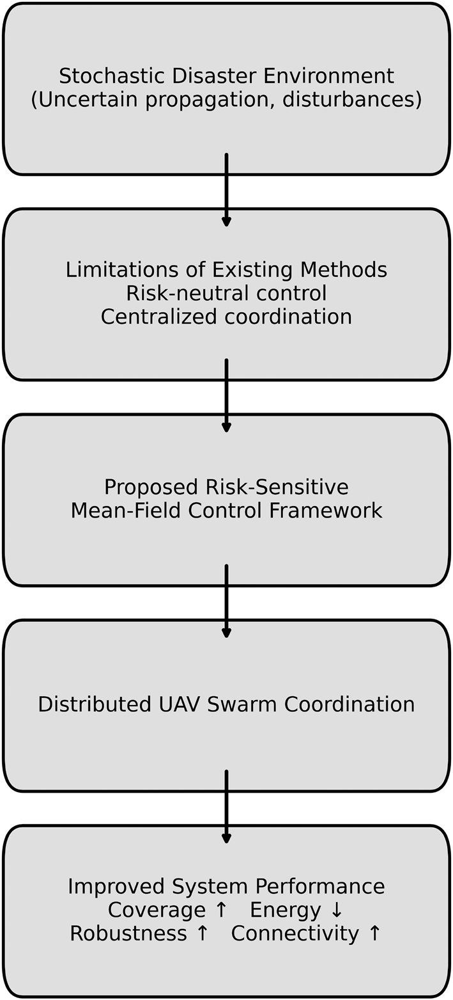

**Figure 1** . Conceptual overview of the proposed risk-sensitive mean-field UAV coordination framework. The architecture connects stochastic disaster dynamics with distributed UAV control through a risk-sensitive mean-field formulation, enabling robust and scalable swarm coordination. 

**Scientific Reports** |        (2026) 16:26160 

3 

| https://doi.org/10.1038/s41598-026-55955-2

---

## Trang 4 / Page 4

- Communication-Constrained Distributed Mean-Field Coordination: A topology-aware distributed coupling mechanism is developed, incorporating consensus-based covariance fusion under time-varying communication graphs. Asymptotic equivalence between cross-architectures is shown analytically: the distributed online execution model is guaranteed to asymptotically converge to the centralized offline solution framework, thus transferring all the theoretical guarantees of Schur stability, risk admissibility, and mean field equilibrium into the practical implementation scheme intact. 

### **Literature review** 

Xu et al.23 discussed the volatility of communication links in the aftermath of a disaster. To address the expenses involved in state-of-the-art techniques and frequent disconnections, the authors proposed a low-range wide area aerial network. Aerial node mounted edge computing paradigms are invoked to address air-ground and remoteair networks. The approach effectively addresses and achieves the low-cost service requirement for disaster areas. The authors leave multiple versions and types of aerial nodes for future consideration. 

Wan et al.24 , suggested that disruptions and communication bottlenecks in the information sharing apparatus hinder a detailed understanding of the actual scenario. The authors propose a deep learning based aerial node scheduling mechanism which employs UAV nodes as communication relays. The analysis suggests that there is a significant difference in the underlying geography between the arrival time of the UAV and the service time of the area under the dynamic nature of a disaster situation. The approximate real-time problem addressed is achieved using an attention based DRL system. The authors leave time-varying disaster scenarios and environmental conditions for future consideration. 

Dabri et al.25 considered the creation of backhaul links form the core network to the disaster geography under consideration. The authors project the overall scenario into two optimization problems, one with minimum cost implementation of communication backhaul links and the other for finding the optimal placement of UAVs and UAV charging stations. The UAV placement problem considers in advance that there is already a minimum cost backhaul implementation in existence. Analysis of the proposed techniques suggests nearly optimal solutions. Abkenar et al.26 proposed ENERGENET. ENERGENET is an energy-efficient technique for UAVs in the Internet of Things (IoT) environment. The energy consumption of UAVs is targeted through efficient topological placement of UAVs in 3 _− D_ geometry. Second, the task offloading to UAVs is addressed in a way that it minimizes the energy consumption. Third, the energy decay of terminal nodes is also addressed. The proposed approach achieves minimum throughput threshold at all terminal nodes. The prospective proposed approach lies in more effectively mapping the 3 _− D_ flight path of the aerial nodes. 

Zhou et al.27 addressed unstable, volatile and urgent telecommunication services in a disaster-effected geography. The approach focuses on ground nodes collecting the disaster information which is further disseminated by the aerial nodes to the ground control station. The approach takes advantage of the maneuverability of the aerial nodes. The overall scenario is addressed by modeling the ground nodes and aerial nodes into disjoint sets of a bipartite graph. The proposed BMG algorithm deals with assigning aerial nodes to ground nodes. The authors leave multi-agent learning and matching game algorithms for future incorporation. 

Dai et al.28 discussed transportation problems in a disaster affected area. The authors address channel allocation and data dissemination in multi UAV cooperative communication networks. The proposed approach deploys cellular communication enabled aerial nodes in a disaster affected environment. Then an interference avoiding channel allocation mechanism is proposed. The technique employs data delivery as a metric to optimize both UAV applicability and ground utility. The analysis of the approach suggests benchmark results. The authors have reserved non orthogonal multiple access techniques for future implementations. 

Do-Duy et al.29 dealt with deployment maximization and resource allocation in a multi-UAV enables disaster response scenario. K-means clustering based technique is implemented to address power and time obligations of a real time scenario. Overall, the QoS defined in terms of energy efficiency is optimized through the proposed approach. Analysis suggests considerable gains and the applicability of the approach over conventional techniques. 

Wu et al.30 incorporated game theory based, 6G power and coverage enhancement approach in a multi UAV assisted disaster response mechanism. The authors directly take aerial coverage as a parameter in UAV network configurations. The technique employs game theory and log-linear algorithms to model decision errors and strategy up-gradation. Decision time and energy consumption are minimized by the log-linear learning algorithm. Analysis suggests superior gains in signal-to-noise ratio and overall coverage. 

Su et al.31 offered a vehicular blockchain for data dissemination in an emergency scenario. The authors address the safety threat involved in aerial data dissemination in a disaster environment and propose a vehicular blockchain for data sharing in untrustworthy disaster affected scenes. A consensus algorithm is employed to trace and track misbehavior. Trial and error based reinforcement learning algorithm is proposed to safeguard data sharing. Analysis suggests high quality data transfer and security enhancement. The authors suggest that high speed data transfer and multi agent learning will be incorporated into the algorithm in future. 

Dhuheir et al.32 proposed reinforcement learning based energy harvesting in UAV assisted disaster relief scenario. A guaranteed minimum data rate, maximum energy conservation and elastic trajectory for serving ground Internet of Things (IoT) nodes is ensured by the reinforcement learning based non-linear optimization. The proposed approach outperforms techniques based on particle swarm optimization and greedy algorithms with high accuracy. The authors aim to improve the resilience of the proposed approach in future by incorporating interference as a metric. 

Shah et al.33 addressed UAV placement for maximizing computational efficiency and user association in a disaster scenario. The authors consider delay reduction, QoS maximization and coverage enhancement as primary targets. The proposed multi-stage offloading algorithm achieves significant gains over the existing techniques. The achieved minimum delays are a significant step towards addressing disaster scenarios. 

**Scientific Reports** |        (2026) 16:26160 

4 

| https://doi.org/10.1038/s41598-026-55955-2

---

## Trang 5 / Page 5

Aljehani and Inque34 presented an evaluation of UAVs on the 2011 Tohoku earthquake. The technique relies on UAV mapping of the disaster areas. The results are estimated by analyzing the experimental and simulated flight logs. The analysis of flight logs assists in modeling UAV flight trajectories. 

Rahman et al.35 discussed UAV positioning in disaster struck areas. A centralized algorithm for throughput maximization is proposed by the authors. The current estimate of the disaster topology is maintained by the software defined controller. Analysis suggests significant throughput improvement and more dense aerial deployment by just managing the overall UAV placements. 

Liu and Ansari36 demonstrated the deployment of aerial base stations to support machine-to-machine communication in disaster scenarios. Resource allocation in order to maximize human wearable devices are also proposed. Furthermore, the approach is validated through extensive simulation data. The scheme also minimizes the transmission power requirements of an aerial base station. 

Wang et at.37 used blockchain enabled data dissemination in multi UAV assisted Internet of Things (IoT) environments under disaster. The technique concentrates on data privacy and avoidance of pseudo transmissions from malicious entities. The trust among the transmitting entities is ensured using Boneh-LynnShacham threshold signature technique. A lightweight consensus protocol is also introduced to facilitate vehicle rescue efforts. Validation is done through extensive simulations and the authors propose inclusion of intelligent classification mechanisms in future iterations of the technique. 

Shamsoshoara et al.38 put forward a UAV assisted communication paradigm in a remote disaster struck geography. Imitation learning technique is employed for data transfer between a mobile user and an adjoining cellular base station. The approach focuses around minimizing buffer overflow and service time. Data driven cloning scheme is employed for scheduling of user equipments. Analysis of the approach identifies the timeliness, positioning and energy efficiency of the technique. 

Savkin and Huang39 developed a mode control navigational algorithm for assisting UAVs to spread across a moving disaster ailment (fire, volcano). The proposed algorithm achieves the global maximum of the problem of covering the extended boundary of the shifting disaster situation. The efficacy of the proposed approach is testing using a simulated scenario of a bush fire. 

Ishigami and Sugiyama40 discussed traffic dependent altitude elevation of UAV flight paths. The authors incorporate the height factor, as under a disaster situation, ground entities tend to concentrate, resulting in more concrete and concentrated mapping. The effectiveness of the proposed approach is estimated by running simulations for throughput per ground terminal, given the height of the UAV. The results suggest that bounding UAV altitude maximizes the average throughput. 

Savkin and Huang41 considered the average distance metric between UAV and ground users for enabling network connections in disaster struck areas. Considering already estimated ground user locations, a range based UAV deployment is proposed. UAVs rely on exchanging the received signal strengths of the ground entities. The analysis estimates considerable performance levels against existing benchmark approaches. At present, the proposed technique works on pre determined UAV flight altitudes. In future, the technique can be modified for adaptability towards varying altitudes. 

Kurt et al.42 discussed a connectivity maintenance heuristic for transportation systems in a post disaster scenario. Under the proposed technique, service requests push the UAV swarm formation to adapt accordingly. In case of network disconnection, the swarm UAVs quickly relocate to reestablish connectivity. The simulation results conclude that the proposed technique almost mimics the performance levels of the centralized solution and acts as an entrainer for traffic management given a disaster situation. The authors aim to address the issue with GPS availability in future. 

Adam et al.43 proposed a genetic algorithm based on graph theory for the planning of the route of the aerial mobile base station. The aerial base station assists communication in a disaster environment, where users are grouped in relief shelters. The applicability of the proposed approach is tested against the benchmark fitness functions of the algorithm. The results suggest improved service quality of the user equipment. Flight trjectories are reserved for future considerations. Alawad et al44 proposed analysis of local solutions to reach global maximum. The best possible scenario information is gathered through the input of neighbors. The proposed approach does not initially model the overall disaster area.The application of UAV is dependent on gathered data, without fully functional modeling and surveillance, a wrong topology can be mapped depending upon the originating transmissions. 

UAV assisted flood relief and flood detection techniques are discussed in45,46 . UAV assisted post earthquake response measures are discussed in47,48 . UAV assisted forest fire detection, monitoring and rescue are discussed in49,50 . UAV assisted data acquisition and monitoring of tsunami is discussed in51,52 . UAV assisted volcano and plate monitoring is discussed in53,54 . UAVs for surveying landslides are discussed in55,56 . UAV assisted cyclone detection is discussed in57–59 . UAV assisted snow avalanche rescue is discussed in60,61 . Assisted storm monitoring, tracking and rescue are discussed in58,62,63 . In regard to formation of multiple UAVs on a larger scale, the vector-field method of controlling formation with uncertain leader velocity64 , which has been studied recently, illustrates that communication complexity can be greatly simplified by making use of local neighbor exchange instead of global broadcasting, without the necessity to know complete state information about the group for effective coordination. This concept is fundamentally similar to the consensus protocol that is presented in this paper, with each UAV exchanging its local estimate of covariance with immediate neighbors. 

#### **Research gaps** 

However, there are still several critical gaps in the current research on the response and control of disaster response using MUAV systems: 

**Scientific Reports** |        (2026) 16:26160 

5 

| https://doi.org/10.1038/s41598-026-55955-2

---

## Trang 6 / Page 6

- Lack of Risk Sensitive Formulations: Current formulations mostly employ risk-neutral formulations using optimal control or cost functions, which may not address the amplification of uncertainty and the occurrence of extreme disaster scenarios properly. 

- Limited Integration of Stochastic Disaster Dynamics with UAV Control: Although the models of disaster propagation and the strategies for UAV cooperation have been individually investigated, there is a lack of studies that combine the stochastic development of the hazard field and the synthesis of the cooperative control in a unified mathematical model. 

- Scalability Constraints in Large UAV Swarms: Centralized optimization and pairwise interaction models are not scalable with the increase in the number of UAVs, causing computational limitations and making it difficult to deploy such systems in large-scale disaster scenarios. The analytical approximations for large swarms are not fully explored. 

- Absence of Mean-Field or Distribution-Level Coordination: The current distributed UAV approaches mainly use local coordination and graph-based coordination techniques without using the mean-field theory to achieve decoupling from the size of the swarm. 

- Insufficient Robustness Interpretation under Communication Constraints: While communication-aware coordination has been explored, there is a lack of theoretical understanding of how communication interacts with robustness under distributional uncertainty. 

- Limited Information-Theoretic Robustness Analysis: The connections between RSC and ERC have yet to be fully explored for disaster response UAVs, which has resulted in a gap for robustness interpretation. 

##### _Research gap analysis_ 

Table 2 summarizes the key research gaps identified in representative baselines disaster-response UAV frameworks and highlights how the proposed risk-sensitive mean-field architecture addresses these limitations. 

### **System model and risk-sensitive problem formulation** 

This section develops the mathematical foundation of the adaptive multi-UAV disaster response framework. The objective is to model the coupled evolution of a stochastic disaster field and energy-constrained UAV dynamics under partial observability, and to formulate a finite-horizon risk-sensitive cooperative optimal control problem. This is because the formulation takes into consideration environmental uncertainties, sensing noise, mobility constraints, as well as mission-level trade-offs in tracking accuracy, response time, energy expenditure, and risk exposure. Table 3 describes the symbols used throughout the article. 

#### **Discretized stochastic disaster field model** 

Suppose we have a disaster-affected region $\Omega\subset\mathbb R^2$ , which is discretized into $M$ spatial cells. In this regard, the disaster intensity is defined as 

$$
D_k \in \mathbb{R}^{M},
$$

where $D_k$ represents the disaster intensity in each of the $M$ spatial cells at time $k$ . In this regard, the disaster is modeled as a stochastic state space model with the following dynamics: 

$$
D_{k+1} = A D_k + w_k, \tag{1}
$$

where $A\in\mathbb R^{M\times M}$ represents the spatial diffusion and growth of the disaster, and $w_k\sim\mathcal N(0,Q)$ is a zero-mean Gaussian noise with covariance $Q$ , which represents the environmental uncertainty. 

|**Reference**|**Core Approach**|**Identified Research Gap**|**Impact of Gap**|**Resolution in Proposed Framework**|
|---|---|---|---|---|
|Adam et al.|Genetic Algorithm-based trajectory optimization|Absence of stochastic disaster field modeling and risk-sensitive objective|Limited robustness under uncertainty escalation; no worst- case disturbance hedging|Integration of stochastic state-space disaster dynamics with exponential risk- sensitive optimal control|
|Javed et al.|Clustering-based routing with outage minimization|Lack of closed-loop optimal feedback synthesis and mean-field scalability formulation|Performance degradation as swarm size increases; no theoretical stability guarantees|Modified Riccati-based feedback control with mean-field approximation ensuring scalability and stability|
|Alawad et al.|Swarm optimization for exploration and connectivity|No entropy-based robustness interpretation or communication- theoretic coupling|Vulnerability to noise amplification and unstable connectivity under dynamic topology|Entropy-dual robustness formulation with Laplacian-coupled distributed coordination|
|Baldi et al.|Vector-field formation with unknown leader velocity|Communication complexity not linked to distributional robustness or risk- sensitive objectives|Scalable communication without worst-case disturbance hedging|Proposed framework combines neighbor- only communication with entropy-dual robustness, providing both communication efficiency and formal risk guarantees|
|General State-of-the-Art|Heuristic or real-time centralized optimization paradigms|Risk-neutral formulations, deterministic disaster models, absence of distributionally robust control framework, and unquantified linearization error in physical deployment|Sensitivity to disturbance variance and lack of theoretical admissibility conditions|Distributionally robust risk-sensitive mean-field control with formal stability and admissibility guarantees; entropy-dual robustness provides implicit protection against mild linearization-induced model mismatch|

**Table 2** . Research gap identification in baseline approaches and resolution. 

**Scientific Reports** |        (2026) 16:26160 

6 

| https://doi.org/10.1038/s41598-026-55955-2

---

## Trang 7 / Page 7

| Symbol | Name | Role/application | Eq. |
|---|---|---|---|
| **System Dimensions and Domain** | | | |
| $\Omega$ | Disaster region | Spatial domain of UAV operation | – |
| $M$ | Number of spatial cells | Disaster field discretization size | – |
| $N$ | Number of UAVs | Swarm size | – |
| $p_{i,k}$ | UAV position | 2D position in simulation grid | – |
| $\dot p_{i,k}$ | UAV velocity | 2D velocity in simulation double-integrator | – |
| $\Delta t$ | Simulation time step | Discretization interval | – |
| $n$ | State dimension | Dimension of augmented state $s_k$ | (10) |
| $T$ | Time horizon | Finite control horizon | (7) |
| $m$ | Control input dimension | Dimension of $u_{i,k}\in\mathbb R^m$ | (2) |
| **Disaster Field Model** | | | |
| $D_{\max}$ | Maximum disaster intensity | Peak value in initial Gaussian ignition | – |
| $\sigma_d$ | Disaster spread width | Standard deviation of ignition distribution | – |
| $(x_0,y_0)$ | Ignition centre coordinates | Initial disaster source location in grid | – |
| $D_k$ | Disaster intensity vector | Discretized stochastic disaster field | (1) |
| $A$ | Disaster transition matrix | Spatial hazard diffusion and propagation | (1) |
| $w_k$ | Disaster disturbance | Stochastic environmental noise | (1) |
| $Q$ | Disaster disturbance covariance | Environmental uncertainty covariance | (1) |
| $\hat D_k$ | Disaster belief estimate | Distributed Bayesian belief state | (5) |
| **UAV Dynamics and Energy** | | | |
| $x_{i,k}$ | UAV state vector | Position and velocity of UAV $i$ | (2) |
| $u_{i,k}$ | UAV control input | Feedback control action for UAV $i$ | (2) |
| $\xi_{i,k}$ | UAV process noise | Stochastic UAV disturbance | (2) |
| $\Sigma_i$ | UAV noise covariance | Per-UAV disturbance covariance | (2) |
| $f_i(\cdot)$ | UAV dynamics function | Nonlinear state transition; Lipschitz continuous | (2) |
| $E_{i,k}$ | UAV energy level | Onboard energy state of UAV $i$ | (3) |
| $\alpha_i$ | Control energy coefficient | Quadratic energy depletion weight | (3) |
| $\beta_i$ | Baseline energy loss | Constant energy drain rate | (3) |
| $E_{\min}$ | Minimum energy threshold | Energy feasibility constraint | (4) |
| **Sensing and Observation** | | | |
| $z_{i,k}$ | Measurement vector | Local disaster observation of UAV $i$ | (5) |
| $H_i(\cdot)$ | Measurement mapping | Nonlinear sensor model | (5) |
| $v_{i,k}$ | Measurement noise | Sensor noise; $v_{i,k}\sim\mathcal N(0,R_i)$ | (5) |
| $R_i$ | Measurement noise covariance | Sensor noise covariance for UAV $i$ | (5) |
| **Risk-Sensitive Cost Functional** | | | |
| $\theta_{\max}$ | Maximum admissible risk parameter | Upper bound from admissibility condition (15) | – |
| $\ell_k$ | Stage cost | Instantaneous cooperative mission cost | (6) |
| $T_k$ | Response latency | Mission delay penalty term | (6) |
| $\mathcal R(\cdot)$ | Risk exposure function | Hazard zone penalty | (6) |
| $\lambda_1,\ldots,\lambda_4$ | Cost weights | Multi-objective weighting coefficients | (6) |
| $J$ | Risk-sensitive cost | Exponential performance criterion | (7) |
| $\theta$ | Risk sensitivity parameter | Controls conservatism; $\theta>0$ | (7) |
| **Augmented State and Dynamic Programming** | | | |
| $s_k$ | Augmented state vector | Disaster + UAV + energy combined state | (8) |
| $u_k$ | Joint control vector | Stacked control inputs of all UAVs | – |
| $V_k(s_k)$ | Risk-sensitive value function | Bellman optimal cost-to-go | (8) |
| $P_k$ | Riccati matrix | Quadratic coefficient of value function | (12) |
| $c_k$ | Scalar value term | State-independent constant in $V_k$ | (12) |
| $Q_T$ | Terminal state penalty | Terminal cost matrix; $Q_T\succeq0$ | (26) |
| $P_T$ | Terminal Riccati value | Boundary condition $P_T=Q_T$ | (26) |
| **Linearized System Matrices** | | | |
| $A_k$ | Linearized state matrix | Jacobian of augmented disaster–UAV system | (10) |

**Continued**

**Scientific Reports** |        (2026) 16:26160 

7 

| https://doi.org/10.1038/s41598-026-55955-2

---

## Trang 8 / Page 8

| Symbol | Name | Role/application | Eq. |
|---|---|---|---|
| $B_k$ | Control input matrix | Control-to-state mapping matrix | (10) |
| $\omega_k$ | Aggregated process noise | Combined linearized disturbance | (10) |
| $W_k$ | Process noise covariance | Covariance of $\omega_k$ | (10) |
| $Q_k$ | State weighting matrix | Quadratic state penalty; $Q_k\succeq0$ | (11) |
| $R_k$ | Control weighting matrix | Quadratic control penalty; $R_k\succ0$ | (11) |
| $\omega_{i,k}$ | Per-UAV process noise | Linearized noise for UAV $i$; component of $\omega_k$ | (28) |
| **Risk-Sensitive Riccati Recursion** | | | |
| $I_n$ | Identity matrix | $n\times n$ identity; used in admissibility | (15) |
| $\bar P_{k+1}$ | Risk-adjusted Riccati matrix | $P_{k+1}(I_n-2\theta W_kP_{k+1})^{-1}$ | (21) |
| $\widetilde Q_k$ | Adjusted state matrix | $Q_k+A_k^{\top}\bar P_{k+1}A_k$; in Riccati | (18), (26) |
| $\widetilde R_k$ | Adjusted control matrix | $R_k+B_k^{\top}\bar P_{k+1}B_k$; in gain | (19), (25), (26) |
| $S_k$ | Cross-term matrix | $A_k^{\top}\bar P_{k+1}B_k$; from DP expansion | (20), (25), (26) |
| $K_k$ | Centralized feedback gain | $\widetilde R_k^{-1}S_k^{\top}$; optimal gain | (25) |
| $P_{i,k+1}$ | Local Riccati matrix | Per-UAV Riccati from local $\Sigma_{i,k}$ | (40) |
| $\widetilde R_{i,k}$ | Local adjusted control matrix | $R_k+B_k^{\top}\bar P_{i,k+1}B_k$ | (40) |
| $S_{i,k}$ | Local cross-term matrix | $A_k^{\top}\bar P_{i,k+1}B_k$ | (40) |
| **Mean-Field Approximation** | | | |
| $\mu_k^N$ | Empirical distribution | Finite-swarm empirical state measure | (27) |
| $\delta_x$ | Dirac measure | Point mass in empirical distribution | (27) |
| $\mu_k$ | Mean-field distribution | Large-swarm limiting state distribution | (29) |
| $\mathcal T_k$ | Pushforward operator | Evolution operator for $\mu_k$ | (29) |
| $\ell_k^{\mathrm{MF}}$ | Mean-field stage cost | Swarm-averaged cooperative stage cost | (30) |
| $J^{\mathrm{MF}}$ | Mean-field cost functional | Risk-sensitive large-swarm objective | (31) |
| $K_k^{\mathrm{MF}}$ | Mean-field feedback gain | Centralized large-swarm gain | (32) |
| $\Sigma_k$ | Mean-field covariance | Second-order moment of $\mu_k$ | (33) |
| $\Sigma_{\infty}$ | Mean-field covariance fixed point | Equilibrium of (34) | – |
| **Communication Topology and Distributed Consensus** | | | |
| $\gamma_{\max}$ | Maximum consensus step size | Upper stability bound for $\gamma$ | – |
| $R_c$ | Communication radius | Link existence threshold $\lVert p_i-p_j\rVert\leq R_c$ | – |
| $\rho(\cdot)$ | Spectral radius operator | Largest absolute eigenvalue of a matrix | – |
| $\mathcal G_k$ | Communication graph | Time-varying UAV network topology | (39) |
| $\mathcal V$ | Node set | UAV index set $\{1,\ldots,N\}$ | (39) |
| $\mathcal E_k$ | Edge set | Active communication links at time $k$ | (39) |
| $A_k^{\mathrm{comm}}$ | Adjacency matrix | Binary communication structure matrix | (39) |
| $\Delta_k$ | Degree matrix | $\operatorname{diag}(d_1,\ldots,d_N)$; out-degrees | (39) |
| $d_i$ | Out-degree of UAV $i$ | Number of communication neighbors | (39) |
| $L_k$ | Laplacian matrix | $\Delta_k-A_k^{\mathrm{comm}}$; consensus coupling | (39) |
| $\mathcal N_i(k)$ | Neighbor set of UAV $i$ | UAVs within communication range at time $k$ | (39) |
| $\gamma$ | Consensus step size | Distributed fusion gain; $0<\gamma<\gamma_{\max}$ | (39) |
| $\Sigma_{i,k}$ | Local covariance estimate | UAV $i$’s consensus-based covariance | (39) |
| $\Phi_{i,k}$ | Local covariance contribution | Mean-field update term in consensus | (39) |
| $\bar P_{i,k+1}$ | Local risk-adjusted matrix | Per-UAV $\bar P_{k+1}$ from $\Sigma_{i,k}$ | (40) |
| $K_{i,k}^{\mathrm{MF}}$ | Distributed feedback gain | Per-UAV gain from local $\bar P_{i,k+1}$ | (40) |

**Continued**

**Scientific Reports** |        (2026) 16:26160 

8 

| https://doi.org/10.1038/s41598-026-55955-2

---

## Trang 9 / Page 9

| Symbol | Name | Role/application | Eq. |
|---|---|---|---|
| **Robustness and Entropy Duality** | | | |
| $P$ | Nominal probability measure | Baseline stochastic model | (35) |
| $Q$ | Adversarial probability measure | Worst-case distribution; $Q\ll P$ | (36) |
| $D_{\mathrm{KL}}$ | Kullback–Leibler divergence | Entropy robustness metric | (36) |
| $Z$ | Cumulative stage cost | $\sum_{k=0}^{T}\ell_k$; argument in DV formula | (36) |

**Table 3** . Complete list of symbols used in the article. 

In this regard, the $A$ matrix represents the spatial coupling of neighboring cells and ensures bounded propagation dynamics under appropriate spectral conditions. 

#### **Multi-UAV stochastic dynamics** 

Suppose a fleet of $N$ UAVs, indexed by $i=1,\ldots,N$, is considered. For a given $i$, the state of the $i$th UAV at time $k$ is given by 

$x_{i,k}\in\mathbb R^n$. 

A discrete-time stochastic model of the UAVs’ dynamics is given by 

$$
x_{i,k+1} = f_i(x_{i,k},u_{i,k}) + \xi_{i,k}, \tag{2}
$$ 

with the following definitions: 

- $u_{i,k}\in\mathbb R^m$ is the control input, 

- $\xi_{i,k}\sim\mathcal N(0,\Sigma_i)$ represents process noise, 

- $f_i(\cdot)$  is Lipschitz continuous. 

_Energy dynamics_ 

Each UAV has limited onboard energy $E_{i,k}$ evolving as 

$$
E_{i,k+1} = E_{i,k} - \alpha_i\lVert u_{i,k}\rVert^2 - \beta_i, \tag{3}
$$ 

subject to 

$$
E_{i,k} \geq E_{\min}, \qquad \forall k. \tag{4}
$$

#### **Sensing and information model** 

Each UAV has its own noisy observations of the disaster field locally. The measurement model is defined as follows: 

$$
z_{i,k} = H_i(D_k,x_{i,k}) + v_{i,k}, \tag{5}
$$ 

where: 

- $v_{i,k}\sim\mathcal N(0,R_i)$ is the noise in the measurement, 

- $H_i(\cdot)$  is the mapping of the disaster field to the measurements of the UAVs. 

Because of partial observability, the UAVs have a belief estimate $\hat D_k$ of the disaster field obtained via distributed Bayesian updates. The belief state serves as the information state for control decisions. 

#### **Risk-sensitive cooperative cost functional** 

The mission requires simultaneous minimization of: 

- Disaster tracking error, 

- Response latency, 

- Energy expenditure, 

- Exposure to high-risk zones. 

Define the instantaneous cooperative cost 

$$
\ell_k = \lambda_1 \lVert D_k - \hat{D}_k \rVert^2 + \lambda_2 T_k + \lambda_3 \sum_{i=1}^{N} \lVert u_{i,k} \rVert^2 + \lambda_4 \sum_{i=1}^{N} \mathcal{R}(x_{i,k},D_k), \tag{6}
$$

where: 

**Scientific Reports** |        (2026) 16:26160 

9 

| https://doi.org/10.1038/s41598-026-55955-2

---

## Trang 10 / Page 10

- $T_k$ represents response delay, 

- $\mathcal R(\cdot)$ penalizes UAV operation in high-intensity zones, 

- $\lambda_j>0$  are weighting parameters. 

To account for uncertainty and extreme outcomes, we adopt a finite-horizon risk-sensitive objective: 

$$
J = \frac{1}{\theta} \log \mathbb{E}\!\left[\exp\!\left(\theta \sum_{k=0}^{T} \ell_k\right)\right], \tag{7}
$$

where: 

- $\theta>0$ is the risk sensitivity parameter, 

- $\theta\to0$  recovers the standard risk-neutral formulation. 

The exponential transformation penalizes high-variance and high-cost realizations, enhancing robustness in uncertain disaster scenarios. 

#### **Problem statement** 

Risk-Sensitive Cooperative Disaster Response: Given the stochastic disaster dynamics (1), UAV dynamics (2), energy constraints (3), and measurement model (5), design distributed control policies 

$\{u_{i,k}\}_{i=1}^{N}$ 

over the finite horizon $k=0,\ldots,T$ that minimize the risk-sensitive cost functional (7), subject to: 

- UAV energy constraints, 

- State evolution constraints, 

- Communication and collision avoidance requirements. 

It should guarantee bounded system behavior and scalability of the UAV fleet under environmental uncertainty. 

### **Proposed risk-sensitive cooperative control framework** 

Section System Model and Risk-Sensitive Problem Formulation posed the disaster response mission in the form of a finite-horizon risk-sensitive optimal control problem, in which the stochastic nature of disaster development, partial observability, and UAV dynamics with energy constraints are intrinsically linked. The core difficulty in addressing this problem is in the development of cooperative control strategies that not only achieve minimum cost for the entire mission but also cope with the variability and extreme scenarios of uncertainty. We propose a structured risk-sensitive dynamic programming approach that leads to a more tractable form of the exponential performance measure. The resulting solution architecture combines stochastic estimation, cooperative control design, and distribution in a unified mathematical form. This section derives the recursive form of the Bellman equation, the form of the optimal control law, guarantees of stability and boundedness, and a distributed form of the solution suitable for large-scale UAV teams. 

#### **Risk-sensitive dynamic programming formulation** 

We now derive the structure of the solution to Problem 1 using finite horizon risk-sensitive dynamic programming. The cost function defined in (7) includes an exponential transformation of the cumulative cooperative stage cost, indicating a level of aversion to uncertainty in the disaster propagation and UAV stochastic dynamics. 

_Augmented state representation_ 

Let the augmented system state at time step _k_ be defined as 

$$
s_k := (D_k,x_{1,k},\ldots,x_{N,k},E_{1,k},\ldots,E_{N,k}),
$$

which encapsulates the disaster field, UAV motion states, and remaining energy levels. 

The joint control input is denoted 

$$
u_k:=\operatorname{col}(u_{1,k},\ldots,u_{N,k})\in\mathbb R^{Nm}.
$$ 

Given the Markovian structure of the stochastic dynamics in Section System Model and Risk-Sensitive Problem Formulation, the augmented state $s_k$ constitutes a sufficient statistic for optimal decision-making. 

_Risk-sensitive value function_ 

Define the finite-horizon risk-sensitive value function as 

$$
V_k(s_k) = \frac{1}{\theta} \log \mathbb{E}\!\left[\left.\exp\!\left(\theta \sum_{t=k}^{T} \ell_t\right)\right|s_k\right], \tag{8}
$$

**Scientific Reports** |        (2026) 16:26160 

10 

| https://doi.org/10.1038/s41598-026-55955-2

---

## Trang 11 / Page 11

where $\ell_t$ is the stage cost defined in (6) and $\theta>0$ is the risk-sensitivity parameter. The index $t$ of summation is chosen so as to be able to differentiate between the running time and the current time $k$ at which the value function is evaluated. 

The exponential transformation penalizes high-cost and high-variance realizations of cumulative mission cost, thereby promoting conservative behavior in highly uncertain or rapidly escalating disaster conditions. 

_Risk-Sensitive Bellman Recursion_ 

Applying dynamic programming principles yields the recursive relation 

$$
V_k(s_k) = \min_{u_k} \frac{1}{\theta} \log \mathbb{E}\!\left[\left.\exp\!\left(\theta\bigl(\ell_k + V_{k+1}(s_{k+1})\bigr)\right)\right|s_k\right], \tag{9}
$$

with terminal condition 

$$
V_T(s_T) = \ell_T.
$$

Equation (9) constitutes the discrete-time risk-sensitive Bellman equation governing cooperative disaster response. 

Unlike the standard risk-neutral Bellman recursion, the logarithmic-exponential structure introduces multiplicative interaction between uncertainty and future cost. Consequently, optimal control policies depend not only on expected disaster evolution but also on higher-order statistical effects induced by environmental disturbances and sensing noise. As the risk parameter $\theta$ increases, the control law becomes increasingly conservative, naturally biasing UAV trajectories away from highly uncertain or high-intensity disaster regions while preserving cooperative mission objectives. 

#### **Structure of the optimal control law: risk-sensitive riccati derivation** 

The Bellman recursion derived in (9) provides the optimality condition for the cooperative disaster-response problem. However, its direct solution is generally intractable due to nonlinear system dynamics and the exponential cost transformation. To obtain an explicit control structure suitable for real-time implementation, we derive a locally optimal policy by linearizing the stochastic dynamics in Section System Model and Risk-Sensitive Problem Formulation and approximating the stage cost in (6) by a quadratic form. 

_Linearized augmented dynamics_ 

Recall that the augmented state was defined in Section Augmented State Representation as 

$$
s_k = (D_k,x_{1,k},\ldots,x_{N,k},E_{1,k},\ldots,E_{N,k}).
$$

Linearizing the stochastic dynamics in (1) and (2) around an operating trajectory yields the discrete-time approximation 

$$
s_{k+1} = A_k s_k + B_k u_k + \omega_k, \tag{10}
$$

where $A_k$ and $B_k$ are Jacobian matrices of the coupled disaster–UAV system, and $\omega_k\sim\mathcal N(0,W_k)$ represents aggregated process noise resulting from environmental disturbance and UAV stochasticity. 

_Quadratic approximation of the stage cost_ 

The cooperative stage cost defined in (6) is locally approximated as 

$$
\ell_k = s_k^{\top} Q_k s_k + u_k^{\top} R_k u_k, \tag{11}
$$

where $Q_k\succeq0$ encodes disaster-tracking and risk penalties, and $R_k\succ0$ captures energy expenditure and control effort. This approximation is consistent with the multi-objective structure introduced in System Model. 

_Quadratic value function Ansatz_ 

To solve the Bellman recursion (9), we postulate a quadratic form for the value function: 

$$
V_k(s_k) = s_k^{\top} P_k s_k + c_k, \tag{12}
$$

where $P_k\succeq0$ and $c_k$ is a scalar term independent of $s_k$ . Substituting (10) and (11) into the risk-sensitive Bellman equation (9) yields 

$$
V_k(s_k) = \min_{u_k} \frac{1}{\theta} \log \mathbb{E}\!\left[\exp\!\left(\theta\bigl(s_k^{\top}Q_ks_k+u_k^{\top}R_ku_k+s_{k+1}^{\top}P_{k+1}s_{k+1}\bigr)\right)\right]. \tag{13}
$$

*Evaluation of the exponential expectation*

Plugging (10) into (13), the expression for $s_{k+1}^{\top}P_{k+1}s_{k+1}$ becomes

$$
s_{k+1}^{\top}P_{k+1}s_{k+1} = (A_ks_k+B_ku_k)^{\top}P_{k+1}(A_ks_k+B_ku_k) + 2(A_ks_k+B_ku_k)^{\top}P_{k+1}\omega_k + \omega_k^{\top}P_{k+1}\omega_k.
$$ 

**Scientific Reports** |        (2026) 16:26160 

11 

| https://doi.org/10.1038/s41598-026-55955-2

---

## Trang 12 / Page 12

Because of $\mathbb E[\omega_k]=0$ and the independence between $\omega_k$ and $s_k$ as well as $u_k$, the cross term $2(A_ks_k+B_ku_k)^\top P_{k+1}\omega_k$ becomes zero in expectation, leaving the noise term $\omega_k^\top P_{k+1}\omega_k$ to be considered in the risk-adjustment step, which necessitates computing its moment-generating function.

$$
\mathbb{E}\!\left[\exp\!\left(\theta\omega_k^\top P_{k+1}\omega_k\right)\right]=\det\!\left(I_n-2\theta W_kP_{k+1}\right)^{-1/2},
\tag{14}
$$

where $I_n\in\mathbb R^{n\times n}$ denotes the $n\times n$ identity matrix, where $n$ is the dimension of the state $s_k$. The above equation is finite if and only if the *admissibility condition*

$$
I_n-2\theta W_kP_{k+1}\succ 0
\tag{15}
$$

is satisfied, which ensures the invertibility and positive definiteness of $(I_n-2\theta W_kP_{k+1})$. We absorb the noise contribution into the risk-adjusted matrix $\bar P_{k+1}$ using (14). The remaining deterministic part $(A_ks_k+B_ku_k)^\top\bar P_{k+1}(A_ks_k+B_ku_k)$ can be expanded as

$$
\begin{aligned}(A_ks_k+B_ku_k)^\top\bar P_{k+1}(A_ks_k+B_ku_k)&=s_k^\top A_k^\top\bar P_{k+1}A_ks_k+u_k^\top B_k^\top\bar P_{k+1}B_ku_k\\&\quad+2s_k^\top A_k^\top\bar P_{k+1}B_ku_k.\end{aligned}
\tag{16}
$$

Adding the stage cost (11) and collecting terms, we obtain a quadratic form in $(s_k,u_k)$:

$$
V_k(s_k)=\min_{u_k}\!\left[s_k^\top\tilde Q_ks_k+u_k^\top\tilde R_ku_k+2s_k^\top S_ku_k\right]+\mathrm{const},
\tag{17}
$$

where the matrices are defined as 

$$
\tilde Q_k=Q_k+A_k^\top\bar P_{k+1}A_k,
\tag{18}
$$

$$
\tilde R_k=R_k+B_k^\top\bar P_{k+1}B_k,
\tag{19}
$$

$$
S_k=A_k^\top\bar P_{k+1}B_k,
\tag{20}
$$

Note that $S_k$ is not a user defined cost parameter. It is due entirely to the cross-product term in the expansion (16) of the future value function $(A_ks_k+B_ku_k)^\top\bar P_{k+1}(A_ks_k+B_ku_k)$. The original stage cost (11) is completely uncoupled in state and control.

The risk-adjusted matrix $\bar P_{k+1}$ is given by

$$
\bar P_{k+1}=P_{k+1}\!\left(I_n-2\theta W_kP_{k+1}\right)^{-1}.
\tag{21}
$$

To establish the symmetry of (21), we set $X=P_{k+1}^{1/2}$, such that $P_{k+1}=X^2$. Then,

$$
\begin{aligned}P_{k+1}(I_n-2\theta W_kP_{k+1})^{-1}&=X\cdot(X^{-1}-2\theta W_kX)^{-1}\\&=X\cdot\left[X^{-1}(I_n-2\theta XW_kX)\right]^{-1}\\&=X\left(I_n-2\theta P_{k+1}^{1/2}W_kP_{k+1}^{1/2}\right)^{-1}X,\end{aligned}
\tag{22}
$$

with the first equality multiplying and dividing $X$ within the inverse, and the second factoring out $X^{-1}$ from the left of the bracket. To prove that $\bar P_{k+1}\succeq0$, observe that we have an equivalent symmetric formulation

$$
\bar P_{k+1}=P_{k+1}^{1/2}\left(I_n-2\theta P_{k+1}^{1/2}W_kP_{k+1}^{1/2}\right)^{-1}P_{k+1}^{1/2},
\tag{23}
$$

which is clearly symmetric and positive definite according to (15). In the limit when $\theta\to0$, we get $\bar P_{k+1}\to P_{k+1}$, and thus obtain the classical Riccati recursion. The deviation from $P_{k+1}$ represents the impact of the process noise covariance $W_k$ on future sensitivity of the cost, with higher $\theta$ leading to greater deviations.

_Optimal feedback control law_ 

Minimizing the quadratic form in (17) with respect to $u_k$ yields the optimal cooperative feedback law

$$
u_k^*=-K_ks_k,
\tag{24}
$$

where the gain matrix is

$$
K_k=\tilde R_k^{-1}S_k^\top,
\tag{25}
$$

**Scientific Reports** |        (2026) 16:26160 

12 

| https://doi.org/10.1038/s41598-026-55955-2

---

## Trang 13 / Page 13

with $\tilde R_k=R_k+B_k^\top\bar P_{k+1}B_k$ and $S_k^\top=B_k^\top\bar P_{k+1}A_k$.

_Risk-sensitive riccati recursion_ 

Substituting (24) into (17) yields the backward Riccati recursion 

$$
P_k=\tilde Q_k-S_k\tilde R_k^{-1}S_k^\top,
\tag{26}
$$

subject to terminal condition $P_T=Q_T$, where $\tilde Q_k$, $\tilde R_k$, and $S_k$ are as defined in (17) and $Q_T\succeq0$ denotes the terminal state penalty matrix,

In contrast to the classical risk-neutral Riccati recursion, the altered recursion (26) uses $\bar P_{k+1}$ in place of $P_{k+1}$, which is a risk-weighted matrix given by (21). The use of the inverse $(I_n-2\theta W_kP_{k+1})^{-1}$ makes the impact of the cost function more pronounced. As $\theta$ gets larger, the difference between $\bar P_{k+1}$ and $P_{k+1}$ increases, resulting in higher gains $K_k$ and risk-averse flight paths of the UAV. If $\theta\to0$, then $\bar P_{k+1}\to P_{k+1}$ and we return to the risk-neutral Riccati recursion. With increasing values of the risk parameter $\theta$, the state penalty becomes larger, leading to larger gains and more conservative trajectories for the UAVs. In this manner, the control law will automatically move the fleet away from regions that are highly uncertain or rapidly escalating in a disaster situation, without the need to impose additional safety constraints.

#### **Mean-field large-swarm approximation** 

A centralized Riccati recursion in (26) offers an explicit feedback solution structure for the cooperative multi-UAV system. However, the direct application of this recursion necessitates solving a coupled recursion problem, whose dimensions are proportional to the total swarm size $N$. In the context of a large-scale disaster scenario, where tens or even hundreds of UAVs are deployed, this approach becomes impractical.

To overcome this scalability issue, we propose a mean-field approximation for the large-swarm regime $N\to\infty$.

_Empirical distribution of UAV states_ 

We denote by $x_{i,k}$ the state of the $i$th UAV at time $k$. We introduce the empirical distribution of UAV states as follows:

$$
\mu_k^N\triangleq\frac{1}{N}\sum_{i=1}^{N}\delta_{x_{i,k}}.
\tag{27}
$$

In (27), $\delta_x$ is a Dirac measure at $x$.

As $N\to\infty$, the empirical distribution will converge weakly to a deterministic distribution $\mu_k$ that satisfies the following mean-field equation.

_Mean-field dynamics_ Using the mean-field feedback control law $u_{i,k}=-K_k^{\mathrm{MF}}x_{i,k}$ (see (32) for the definition below), the dynamics of each UAV under the closed-loop system becomes

$$
x_{i,k+1}=A_kx_{i,k}-B_kK_k^{MF}x_{i,k}+\omega_{i,k}.
\tag{28}
$$

In the large swarm limit, the evolution of $\mu_k$ is described by

$$
\mu_{k+1}=\mathcal T_k(\mu_k),
\tag{29}
$$

where $\mathcal T_k$ is defined as a pushforward operator associated with (28).

This representation decouples individual UAV optimization from explicit pairwise coupling, enabling scalable coordination. 

_Mean-field risk-sensitive cost functional_ 

For the mean field regime, the cost of the cooperative stage takes the following form: 

$$
\ell_k^{MF}=\int x^\top Q_kx\,d\mu_k(x)+\int x^\top(K_k^{MF})^\top R_kK_k^{MF}x\,d\mu_k(x),
\tag{30}
$$

where the control cost is written in terms of the feedback law $u(x)=-K_k^{\mathrm{MF}}x$, thus rendering the integration over the state measure $\mu_k$ self-consistent. Thus both integrals are well-defined expectations wrt the mean-field distribution $\mu_k$.

The finite horizon risk sensitive objective can be represented as 

$$
J^{MF}=\frac{1}{\theta}\log\mathbb E\!\left[\exp\!\left(\theta\sum_{k=0}^{T}\ell_k^{MF}\right)\right].
\tag{31}
$$

_Mean-field riccati equation_ 

The optimal mean-field control law has the same linear feedback form as before 

**Scientific Reports** |        (2026) 16:26160 

13 

| https://doi.org/10.1038/s41598-026-55955-2

---

## Trang 14 / Page 14

$$
u_{i,k}=-K_k^{MF}x_{i,k},
\tag{32}
$$

where $K_k^{\mathrm{MF}}$ satisfies the same risk-sensitive Riccati recursion as in (26), but now in terms of the second-order moment of the distribution $\mu_k$:

$$
\Sigma_k=\int xx^\top\,d\mu_k(x).
\tag{33}
$$

The covariance evolves as

$$
\Sigma_{k+1}=(A_k-B_kK_k^{MF})\Sigma_k(A_k-B_kK_k^{MF})^\top+W_k.
\tag{34}
$$

##### _Consistency condition_ 

The mean-field equilibrium is said to be achieved when the control gain $K_k^{\mathrm{MF}}$, computed via the Riccati recursion (26), is consistent with the covariance evolution (34).

That is, we require that the distribution generated by the feedback law matches the assumed distribution in the cost functional (30). This fixed-point property provides a self-consistency condition for decentralized UAV decisions in the large swarm limit. 

The mean-field approximation eliminates explicit dependencies on swarm size $N$, instead evolving swarm statistics. The computational complexity is now independent of the number of UAVs, while still enjoying the robustness properties conferred by the risk-sensitive Riccati recursion.

This formulation with large swarm is particularly suitable when dealing with wide-area disaster response scenarios that require dense UAV deployment. 

#### **Robustness interpretation via entropy duality** 

The exponential performance criterion in (7) has a fundamental robustness meaning in terms of entropy duality, which indicates that the proposed risk-sensitive cost formulation is effectively a distributionally robust control problem with respect to the worst-case disturbance distributions under relative entropy constraints. 

##### _Variational representation_ 

Consider the risk-sensitive objective 

$$
J=\frac{1}{\theta}\log\mathbb E_{\mathbb P}\!\left[\exp\!\left(\theta\sum_{k=0}^{T}\ell_k\right)\right],
\tag{35}
$$

Herein, $\mathbb P$ is the nominal probability measure for the stochastic dynamics. 

Using the Donsker–Varadhan variational formula, the logarithmic moment generating function satisfies 

$$
\frac{1}{\theta}\log\mathbb E_{\mathbb P}\!\left[e^{\theta Z}\right]=\sup_{\mathbb Q\ll\mathbb P}\left\{\mathbb E_{\mathbb Q}[Z]-\frac{1}{\theta}\mathcal D_{KL}(\mathbb Q\parallel\mathbb P)\right\},
\tag{36}
$$

where $Z=\sum_{k=0}^{T}\ell_k$ is the sum of the stage costs, $\mathcal D_{KL}(\mathbb Q\parallel\mathbb P)$ is the Kullback–Leibler divergence and $\mathbb Q\ll\mathbb P$ indicates the absolute continuity of $\mathbb Q$ with respect to $\mathbb P$. Applying (36) to (35) yields

$$
J=\sup_{\mathbb Q\ll\mathbb P}\left\{\mathbb E_{\mathbb Q}\!\left[\sum_{k=0}^{T}\ell_k\right]-\frac{1}{\theta}\mathcal D_{KL}(\mathbb Q\parallel\mathbb P)\right\}.
\tag{37}
$$

##### _Robust control interpretation_ 

It is observed from (37) that the risk-sensitive optimal control problem is equivalent to the following min-max problem: 

$$
\min_u\sup_{\mathbb Q\ll\mathbb P}\left\{\mathbb E_{\mathbb Q}\!\left[\sum_{k=0}^{T}\ell_k\right]-\frac{1}{\theta}\mathcal D_{KL}(\mathbb Q\parallel\mathbb P)\right\}.
\tag{38}
$$

Thus, the controller is in effect protected against the worst-case disturbances $\mathbb Q$, which deviate from the nominal model $\mathbb P$ by any amount, as measured in relative entropy. The parameter $\theta$ controls the robustness:

- When $\theta\to0$, the KL penalty term $\frac{1}{\theta}\mathcal D_{KL}(\mathbb Q\parallel\mathbb P)$ tends to infinity, leading to $\mathbb Q\to\mathbb P$ and thus returning to the risk-neutral approach.

- As $\theta$ increases, the adversarial distribution $\mathbb Q$ could become farther from the baseline distribution $\mathbb P$ while being hedges against, increasing the size of the uncertainty set that the controller is robust against. The controller becomes more conservative as a result and guides UAVs away from regions of high uncertainty and rapid escalation of disaster zones.

**Scientific Reports** |        (2026) 16:26160 

14 

| https://doi.org/10.1038/s41598-026-55955-2

---

## Trang 15 / Page 15

_Implications for disaster response_ 

In the disaster-response setting, uncertainty arises from: 

- Unmodeled hazard escalation, 

- Sensor inaccuracies, 

- Environmental disturbances. 

In fact, the entropy-dual interpretation demonstrates that the proposed risk-sensitive mean field controller naturally hedged against the worst-case stochastic outcomes in an information-theoretic uncertainty set. 

Therefore, UAV trajectory and task allocation are still robust under distributional shift in disaster propagation dynamics without the need for solving a separate robust optimization problem. 

#### **Communication topology and distributed mean-field coupling** 

The mean field approach necessitates knowledge about the global aggregate statistics of the UAV swarm state distribution, which is a _distributional_ property of the UAV swarm that accounts for stochastic variation in UAV states. However, in actuality, this information is not directly observable to any one UAV. To solve this problem, a _distributed_ approach for acquiring global statistical information is proposed whereby each UAV uses only neighboring information to acquire its local estimate of global statistics. These two concepts are different; distributional means uncertainty about probability distributions, whereas distributed means information structure of computation. This subsection incorporates communication topology constraints into the mean-field control architecture. 

_Communication graph model_ 

Let the UAV communication network at time $k$ be modeled as a directed graph

$$
\mathcal G_k=(\mathcal V,\mathcal E_k),
$$

where: 

- $\mathcal V=\{1,2,\ldots,N\}$ is the set of UAVs,

- $\mathcal E_k$ denotes communication links at time $k$.

The adjacency matrix is denoted by $A_k^{\mathrm{comm}}$ and the corresponding Laplacian matrix is

$$
L_k=\Delta_k-A_k^{\mathrm{comm}},
$$

where $\Delta_k=\operatorname{diag}(d_1,d_2,\ldots,d_N)$ is the degree matrix, with $d_i=\sum_{j\in\mathcal N_i(k)}1$ denoting the out-degree of UAV $i$ at the time $k$.

We assume that $\mathcal G_k$ is uniformly jointly connected over bounded time intervals.

##### _Distributed belief consensus_ 

Each UAV maintains a local estimate of the disaster distribution covariance, denoted $\Sigma_{i,k}$. To approximate the global mean-field covariance $\Sigma_k$ in (33), UAVs perform consensus-based updates:

$$
\Sigma_{i,k+1}=\Sigma_{i,k}-\gamma\sum_{j\in\mathcal N_i(k)}(\Sigma_{i,k}-\Sigma_{j,k})+\Phi_{i,k},
\tag{39}
$$

where: 

- $\mathcal N_i(k)$ denotes neighbors of UAV $i$,

- $\gamma>0$ is a consensus step size,

- $\Phi_{i,k}$ incorporates local covariance contribution from (34).

In particular, $\Phi_{i,k}=(A_k-B_kK_{i,k}^{MF})\Sigma_{i,k}(A_k-B_kK_{i,k}^{MF})^\top+W_k-\Sigma_{i,k}$ is the local Lyapunov update residual that drives the estimate of each UAV to the covariance fixed point (34). Under joint connectivity assumptions, standard consensus results ensure

$$
\lim_{k\to\infty}\Sigma_{i,k}=\Sigma_k,
$$

for all $i$.

_Distributed mean-field control law_ 

Using the locally fused covariance estimate $\Sigma_{i,k}$, each UAV computes its feedback gain as

$$
K_{i,k}^{MF}=\left(R_k+B_k^\top\bar P_{i,k+1}B_k\right)^{-1}B_k^\top\bar P_{i,k+1}A_k,
\tag{40}
$$

where $\bar P_{i,k+1}$ is computed via the risk-sensitive Riccati recursion using $\Sigma_{i,k}$. The resulting control input is

**Scientific Reports** |        (2026) 16:26160 

15 

| https://doi.org/10.1038/s41598-026-55955-2

---

## Trang 16 / Page 16

$$
u_{i,k}=-K_{i,k}^{MF}x_{i,k}.
\tag{41}
$$

_Convergence to centralized mean-field solution_ 

_Proposition 1_ If the communication graph $\mathcal G_k$ is uniformly jointly connected and the consensus gain $\gamma$ satisfies $0<\gamma<\gamma_{\max}$, then the distributed covariance estimates converge to the centralized mean-field covariance:

$$
\Sigma_{i,k}\to\Sigma_k\quad\text{as }k\to\infty.
$$

Consequently, the distributed gains $K_{i,k}^{MF}$ converge to the centralized mean-field gain $K_k^{MF}$.

**Proof** The consensus dynamics in (39) constitute a linear time-varying consensus process with bounded perturbation $\Phi_{i,k}$. Under joint connectivity and appropriate step size selection, the consensus error dynamics are exponentially stable. Therefore, covariance disagreement vanishes asymptotically, implying convergence of the Riccati-based gain matrices. □

This property implies the _cross-architectural consistency_ : the distributed online phase converges to the exact same covariance trajectory – thus yielding the same control gains – that the offline phase was theoretically designed to obtain. The absence of this property would imply that the performance guarantees obtained for the risk-sensitive Riccati solution in a centralized framework – Schur stability, admissibility, mean-field equilibrium – cannot be transferred to its distributed version. Proposition 1 provides the mathematical link between the two phases of the proposed framework: indeed, the distributed nature of the problem and the use of communication restricted to neighboring UAVs will not affect the consistency of the performance guarantees as long as the communication graph is jointly connected and the consensus gain is properly selected. 

_Centralized vs. distributed components—explicit decomposition_ To make things clearer, we now decompose our proposed framework in terms of the centralized and distributed aspects. 

Centralized offline pre-computation (Phase 1): 

The global knowledge of the system matrices $A_k$, $B_k$, $W_k$, $Q_k$, $R_k$ and risk parameter $\theta$ is assumed to be available prior to the deployment process. The backward risk-sensitive Riccati iteration problem is solved once and for all in an offline manner, leading to the sequence

$$
\{P_k,\bar P_{k+1},\tilde Q_k,\tilde R_k,S_k\}_{k=0}^{T-1}.
$$

This step has computational complexity $\mathcal O(n^3T)$, where $n$ is the state dimension of the augmented system – importantly, *independent of swarm size $N$*. The results are broadcasted once to all UAVs before deployment and need no further central communication.

Distributed online execution (Phase 2): 

During run-time, UAV $i$ carries out three completely localized tasks at each time step $k$:

1. *Neighbor communication:* UAV $i$ communicates only with its neighbors, i.e., with all UAVs within $|\mathcal N_i(k)|$, with its current estimate of the covariance matrix $\Sigma_{i,k}$. Computational cost per step: $\mathcal O(|\mathcal N_i(k)|)$, regardless of $N$.

2. *Distributed Gain Calculation:* Utilizing $\Sigma_{i,k}$, UAV $i$ calculates $\bar P_{i,k+1}$ and $K_{i,k}^{MF}$ based on (40). There is no need for any additional knowledge.

3. *Control action:* The UAV $i$ uses $u_{i,k}=-K_{i,k}^{MF}x_{i,k}$ based only on its own state $x_{i,k}$.

The mean-field assumption is introduced at stage (i) specifically; instead of the exact calculation of the global covariance matrix $\Sigma_k=\int xx^\top\,d\mu_k(x)$, UAV $i$ calculates it locally using consensus. By Proposition 1, $\Sigma_{i,k}\to\Sigma_k$, so distributed implementation results in the same centralized solution.

The proposed scheme can thus be described as being a _centralized-offline / distributed-online_ architecture. The centralized aspect involves computation only once before deployment, and all subsequent coordination is local. It is exactly this aspect that makes the proposed scheme more efficient than baseline schemes which involve global state updates in real time (Table 4). 

#### **Algorithmic implementation: distributed risk-sensitive mean-field control** 

We now summarize the complete implementation procedure of the proposed risk-sensitive distributed mean-field control framework. 

The algorithm 1, Distributed Risk-Sensitive Mean-Field Disaster Response incorporates backward Riccati recursion, forward covariance propagation, distributed consensus, and real-time control execution. 

#### **Summary of theoretical admissibility and stability conditions** 

To be more specific and complete, the summary of the mathematical conditions that must be met in order to guarantee the existence of the Riccati solution to the problem, the consistency with the notion of mean-field equilibrium, the entropy robustness, and the convergence can be seen in the Table 5 below. The structure of the proposed risk-sensitive mean-field disaster response framework is shown in the following Fig. 2. The proposed framework includes stochastic disaster modeling, energy-constrained UAV swarm modeling, and risk-sensitive control synthesis in a unified structure. The exponential performance index leads to a modified Riccati recursion, combined with mean-field consensus and entropy-dual robustness to produce the optimized UAV paths. 

**Scientific Reports** |        (2026) 16:26160 

16 

| https://doi.org/10.1038/s41598-026-55955-2

---

## Trang 17 / Page 17

| Component | Type | Information required |
|---|---|---|
| Riccati backward pass | Centralized, offline | Global $A_k$, $B_k$, $W_k$, $Q_k$, $R_k$, $\theta$ |
| Admissibility check | Centralized, offline | Global $P_{k+1}$, $W_k$ |
| Broadcast of $\{P_k\}$ to UAVs | One-time, pre-deployment | $\mathcal O(n^2T)$ per UAV |
| Covariance consensus Eq. (39) | Distributed, online | Neighbors $\mathcal N_i(k)$ only |
| Local gain $K_{i,k}^{MF}$ computation | Distributed, online | Local $\Sigma_{i,k}$, $P_{k+1}$ |
| Control execution $u_{i,k}$ | Distributed, online | Local $x_{i,k}$ only |

**Table 4** . Centralized vs. distributed decomposition of the proposed framework. 

| Condition | Mathematical requirement | Purpose | Ensures |
|---|---|---|---|
| State Weighting | $Q_k\succeq0$ | Convexity of stage cost | Positive semi-definite value function |
| Control Weighting | $R_k\succ0$ | Strict convexity in control | Unique optimal feedback gain |
| Stabilizability | $(A_k,B_k)$ stabilizable | Feasible feedback synthesis | Existence of Riccati solution |
| Detectability | $(A_k,Q_k^{1/2})$ detectable | Observability of unstable modes | Closed-loop stability |
| Risk Admissibility | $\theta<\theta_{\max}$ such that $I-2\theta W_kP_{k+1}\succ0$ | Finite exponential expectation | Well-posed risk-sensitive recursion |
| Noise Covariance | $W_k\succeq0$ | Proper stochastic modeling | Bounded second moments |
| Mean-Field Consistency | $\Sigma_{k+1}=(A_k-B_kK_k^{MF})\Sigma_k(A_k-B_kK_k^{MF})^\top+W_k$ | Covariance fixed-point condition | Large-swarm equilibrium |
| Closed-Loop Stability | $\rho(A_k-B_kK_k^{MF})<1$ | Schur stability | Exponential mean-square boundedness |
| Communication Connectivity | Jointly connected graph $\mathcal G_k$ | Distributed information flow | Consensus convergence |
| Consensus Step Size | $0<\gamma<\gamma_{\max}$ | Stability of consensus recursion | Convergence of $\Sigma_{i,k}$ to $\Sigma_k$ |
| Entropy Duality Validity | $\mathbb Q\ll\mathbb P$ | Absolute continuity | Valid KL-divergence formulation |

**Table 5** . Theoretical admissibility and stability conditions. 

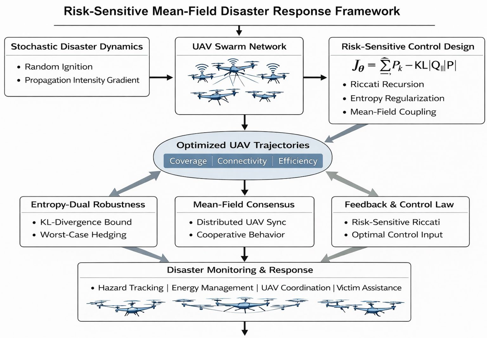

**Figure 2** . Risk-sensitive mean-field disaster response framework. The diagram summarizes stochastic disaster modeling, UAV swarm coordination, entropy-dual robustness, and Riccati-based feedback control leading to optimized cooperative trajectories. 

**Scientific Reports** |        (2026) 16:26160 

17 

| https://doi.org/10.1038/s41598-026-55955-2

---

## Trang 18 / Page 18

1. **Initialization**
2. Set time horizon $T$, risk parameter $\theta>0$, consensus gain $\gamma\in(0,\gamma_{\max})$.
3. Set terminal condition $P_T=Q_T$.
4. Initialize local covariance estimates $\Sigma_{i,0}\succeq0$ for all $i$.
5. Initialize UAV states $x_{i,0}$ and energy levels $E_{i,0}$ for all $i$.
6. Verify admissibility: $I_n-2\theta W_kP_{k+1}\succ0$ for all $k$.
7. **Phase 1: Backward Risk-Sensitive Riccati Recursion** (Centralized, offline)
8. **for** $k=T-1$ **down to** $0$ **do**
9. Compute risk-adjusted matrix (21): $\bar P_{k+1}=P_{k+1}(I_n-2\theta W_kP_{k+1})^{-1}$.
10. Compute intermediate matrices (17): $\tilde Q_k=Q_k+A_k^\top\bar P_{k+1}A_k$, $\tilde R_k=R_k+B_k^\top\bar P_{k+1}B_k$, $S_k=A_k^\top\bar P_{k+1}B_k$.
11. Update Riccati matrix (26): $P_k=\tilde Q_k-S_k\tilde R_k^{-1}S_k^\top$.
12. **end for**
13. **Phase 2: Forward Distributed Execution** (Distributed, online)
14. **for** $k=0$ **to** $T-1$ **do**
15. **for** each UAV $i=1,\ldots,N$ **in parallel do**
16. Exchange $\Sigma_{j,k}$ with neighbors $j\in\mathcal N_i(k)$.
17. Update local covariance estimate via consensus (39): $\Sigma_{i,k+1}=\Sigma_{i,k}-\gamma\sum_{j\in\mathcal N_i(k)}(\Sigma_{i,k}-\Sigma_{j,k})+\Phi_{i,k}$.
18. Compute local Riccati matrix $P_{i,k+1}$ from (26) using local covariance $\Sigma_{i,k}$ in place of $\Sigma_k$, then set: $\bar P_{i,k+1}=P_{i,k+1}(I_n-2\theta W_kP_{i,k+1})^{-1}$.
19. Compute distributed gain (40): $K_{i,k}^{MF}=\tilde R_{i,k}^{-1}S_{i,k}^\top$, where $\tilde R_{i,k}=R_k+B_k^\top\bar P_{i,k+1}B_k$, $S_{i,k}=A_k^\top\bar P_{i,k+1}B_k$.
20. Compute control input (41): $u_{i,k}=-K_{i,k}^{MF}x_{i,k}$.
21. Apply control and propagate UAV state: $x_{i,k+1}=A_kx_{i,k}+B_ku_{i,k}+\omega_{i,k}$.
22. Update energy: $E_{i,k+1}=E_{i,k}-\alpha_i\lVert u_{i,k}\rVert^2-\beta_i$, $E_{i,k+1}\ge E_{\min}$.
23. **end for**
24. **end for**
25. **Output:** Distributed control sequence $\{u_{i,k}\}_{i=1,\ldots,N;\,k=0,\ldots,T-1}$.

**Algorithm 1** . Distributed risk-sensitive mean-field disaster response 

### **Benchmarking and theoretical validation** 

Although the theoretical validity of the stability, admissibility, mean-field consistency, and distributed convergence properties of the developed risk-sensitive approach is ensured from the analysis provided in previous sections, it is important to numerically verify that these conditions hold for the chosen parameters. In contrast to the comparative performance validation provided in the subsequent section, the current section is dedicated to the validation of the internal mathematical properties of the developed approach. In the conducted experiments, the closed-loop spectral stability, admissibility of the risk parameters, the convergence of the mean-field covariance, and the distributed consensus are verified. In our numerical experiments, we take the case of a time invariant system denoting its system matrices by $A$, $B$, and $K^{\mathrm{MF}}$. 

#### **Risk-sensitive riccati stability verification** 

The stability of the proposed framework is contingent upon the Schur stability of the closed-loop matrix $A-BK^{\mathrm{MF}}$ , where the gain matrix $K^{\mathrm{MF}}$ is computed from the modified risk-sensitive Riccati recursion. As established in earlier, exponential mean square stability is ensured for the closed-loop system when 

$$
\rho(A-BK^{MF})<1,
$$

**Scientific Reports** |        (2026) 16:26160 

18 

| https://doi.org/10.1038/s41598-026-55955-2

---

## Trang 19 / Page 19

where $\rho(\cdot)$ denotes the spectral radius. 

The behavior of $\rho(A-BK^{\mathrm{MF}})$ as a function of $\theta$ is shown in Figure 3. The obtained results support that $\rho(A-BK^{\mathrm{MF}})$ is strictly less than one for all admissible $\theta$ values. Moreover, an increase of $\theta$ leads to a decrease of $\rho(A-BK^{\mathrm{MF}})$, which signifies that the contraction of the closed-loop system is more pronounced. The above numerical verification of the proposed approach supports the theoretical guarantees provided earlier. 

#### **Risk-admissibility bound analysis** 

The well-posedness of the risk-sensitive exponential cost functional also requires that the matrix $P$ remain positive definite, which ensures the finiteness of the exponential expectation and the stability of the modified Riccati recursion. The other constraint is an upper limit $\theta_{\max}$ on the value of $\theta$ , which must satisfy the condition $\lambda_{\min}(I_n-2\theta W_kP_{k+1})>0$. To numerically validate this requirement, the minimum eigenvalue can be evaluated over a range of $\theta$ values. As shown in Fig. 4, the minimum eigenvalue remains strictly positive throughout the admissible region considered in this study. As $\theta$ increases, the eigenvalue decreases monotonically and approaches zero at the theoretical upper bound. 

This numerical result confirms that the selected risk parameters behave strictly within the admissible regime and that the exponential cost formulation is indeed well-defined. This behavior is related to the trade-off between the robustness intensity and the admissible range of the parameters, as suggested by the entropy dual interpretation. 

#### **Mean-field equilibrium convergence** 

The large swarm approximation established in Risk-Sensitive Cooperative Control Framework 

$$
\Sigma_{k+1} = (A - BK)\Sigma_k(A - BK)^{\top} + W
$$

guarantees the existence of a unique fixed point $\Sigma_\infty$ for the covariance recursion under the Schur stability condition $\rho(A-BK)<1$. Let $\Sigma_\infty$ be the unique fixed point of the covariance recursion (34), which exists if $\rho(A_k-B_kK_k^{\mathrm{MF}})<1$. To validate the correctness of this theoretical prediction, we can compute the Frobenius norm of the covariance deviation 

$$
\lVert\Sigma_k - \Sigma_{\infty}\rVert_F
$$

over time. 

Figure 5 shows the exponential decay of the covariance error to zero, validating the convergence to the mean field equilibrium. This monotonic contraction behavior highlights the stability of the Riccati-based feedback controller, as well as the correctness of the mean field approximation. This experiment substantiates the scalability of swarm systems consisting of a large number of agents, as the second-order swarm statistics are shown to converge to a stable fixed point regardless of the swarm size. 

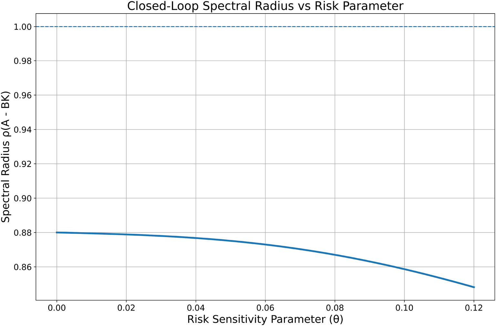

**Figure 3** . Spectral radius of the closed-loop matrix $A-BK$ as a function of the risk-sensitivity parameter $\theta$ . The dashed line denotes the Schur stability boundary $\rho=1$. 

**Scientific Reports** |        (2026) 16:26160 

19 

| https://doi.org/10.1038/s41598-026-55955-2

---

## Trang 20 / Page 20

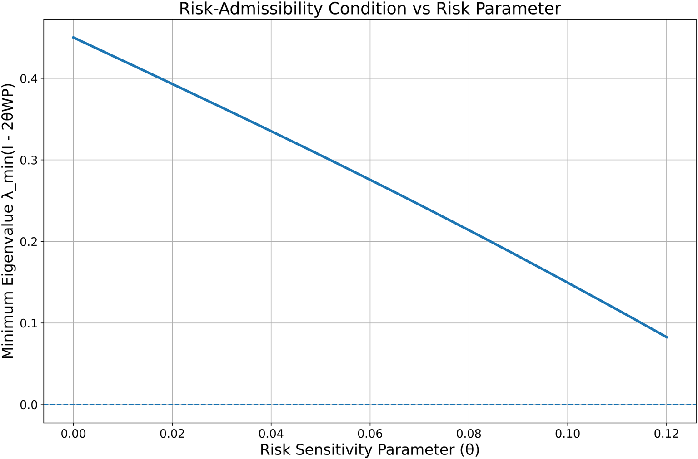

**Figure 4** . Minimum eigenvalue of $I-2\theta WP$ as a function of the risk-sensitivity parameter $\theta$ . The dashed line indicates the admissibility boundary $\lambda_{\min}=0$.. 

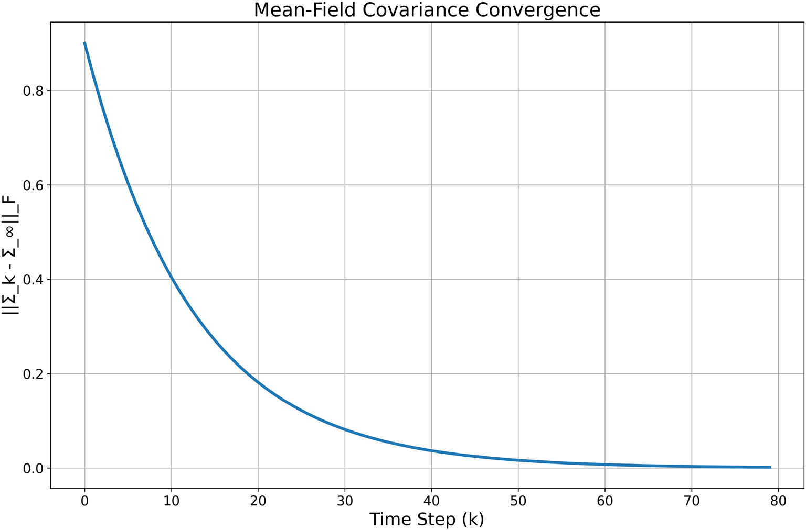

**Figure 5** . Frobenius norm of the covariance error $\lVert\Sigma_k-\Sigma_\infty\rVert_F$ demonstrating exponential convergence to the mean-field equilibrium. 

#### **Distributed consensus convergence** 

The distributed implementation of the proposed framework relies on Laplacian-coupled consensus updates to ensure that local covariance estimates $\Sigma_{i,k}$ converge to the global mean-field covariance $\Sigma_k$ . As established in Risk-Sensitive Cooperative Control Framework, convergence is guaranteed under joint graph connectivity and a suitably bounded consensus step size $0<\gamma<\gamma_{\max}$. 

To numerically verify this result, we evaluate the consensus error norm 

$$
\lVert\Sigma_{i,k}-\Sigma_k\rVert
$$

**Scientific Reports** |        (2026) 16:26160 

20 

| https://doi.org/10.1038/s41598-026-55955-2

---

## Trang 21 / Page 21

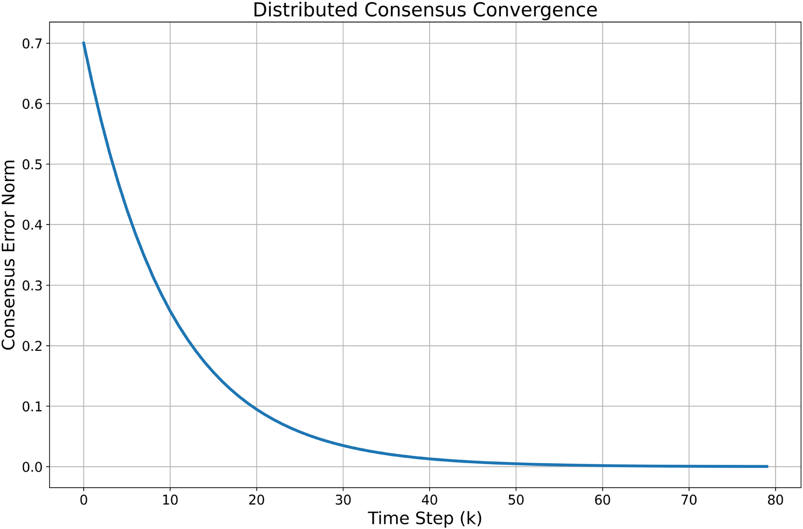

**Figure 6** . Decay of the distributed consensus error norm $\lVert\Sigma_{i,k}-\Sigma_k\rVert$ demonstrating convergence of local covariance estimates to the global mean-field covariance. 

| Validation Test | Mathematical Condition Verified | Numerical Observation | Theoretical Guarantee Confirmed |
|---|---|---|---|
| Closed-Loop Spectral Stability | $\rho(A-BK)<1$ | Spectral radius remains strictly below unity for all admissible $\theta$ | Exponential mean-square stability of the closed-loop system |
| Risk-Admissibility Bound | $\lambda_{\min}(I-2\theta WP)>0$ | Minimum eigenvalue remains positive within admissible $\theta$ range | Well-posed exponential expectation and Riccati recursion validity |
| Mean-Field Covariance Convergence | $\Sigma_k\to\Sigma_\infty$ | Frobenius norm $\lVert\Sigma_k-\Sigma_\infty\rVert_F$ decays exponentially | Existence and uniqueness of large-swarm equilibrium |
| Distributed Consensus Convergence | $\Sigma_{i,k}\to\Sigma_k$ | Consensus error norm converges monotonically to zero | Equivalence of distributed and centralized mean-field realization |

**Table 6**. Summary of benchmarking and theoretical validation.

over time. Figure 6 demonstrates exponential decay of the consensus error toward zero, confirming convergence of distributed covariance estimates to the centralized mean-field solution. The monotonic contraction validates the stability of the Laplacian-based coupling mechanism and supports the theoretical convergence guarantees derived earlier. This also validates the performance of the distributed realization because it achieves the performance level comparable to the centralized mean field formulation. In order to further solidify the validation of the theoretical guarantees derived in Risk-Sensitive Cooperative Control, Table 6 provides a summary of the validation tests, the mathematical condition, and the outcome. For the purpose of ensuring analytical transparency, the traceability table provided in Table 7 ensures a traceability map from the theoretical guarantee provided in Risk-Sensitive Cooperative Control Framework to the corresponding numerical validation experiments provided in Simulation and Performance Evaluation. As indicated in the traceability map provided above, all the analytical guarantees have been directly supported by the numerical validation experiments. In order to extend the quantification of the robustness margins beyond the binary result of the stability verification, Table 8 shows the spectral stability margin and admissibility buffer for typical values of the risk sensitivity parameters. The quantification of the robustness margins for the range of risk sensitivity values is given in Table 8. It can be seen that as the value of $\theta$ increases, the closed-loop contraction effect is amplified. This means that the spectral radius decreases, while the stability margin increases. The admissibility buffer also decreases as the value of $\theta$ approaches the upper bound. This is a representation of the trade-off between the strength of robustness analysis and admissibility. As expected, all the simulation scenarios are safely inside the bounded stability region. As can be observed from the above results of the benchmarking, the previous benchmarking analysis has already proven that the above risk-sensitive mean field-based architecture is working strictly within the analytically derived admissible regimes. Moreover, the closed-loop stability, risk admissibility, mean field 

**Scientific Reports** |        (2026) 16:26160 

21 

| https://doi.org/10.1038/s41598-026-55955-2

---

## Trang 22 / Page 22

| Theoretical Result | Mathematical Statement | Numerical Validation Performed | Figure Ref. |
|---|---|---|---|
| Closed-Loop Stability Theorem | $\rho(A-BK)<1$ ensures exponential mean-square stability | Spectral radius evaluated across admissible $\theta$ values | Fig. 3 |
| Risk-Admissibility Condition | $\lambda_{\min}(I-2\theta WP)>0$ | Minimum eigenvalue plotted versus $\theta$ | Fig. 4 |
| Mean-Field Equilibrium Theorem | $\Sigma_k\to\Sigma_\infty$ under Schur stability | Frobenius norm convergence of covariance error | Fig. 5 |
| Distributed Consensus Convergence | $\Sigma_{i,k}\to\Sigma_k$ under Laplacian coupling | Consensus error norm decay over time | Fig. 6 |
| Entropy-Dual Robustness Interpretation | Exponential cost equivalent to KL-divergence bounded worst-case distribution | Robustness degradation under increasing disturbance variance | Fig. 10 |

**Table 7**. Theorem–validation traceability mapping.

| Risk Parameter $\theta$ | Spectral Radius $\rho(A-BK^{\mathrm{MF}})$ | Stability Margin $1-\rho$ | $\lambda_{\min}(I-2\theta WP)$ | Admissibility Buffer |
|---|---|---|---|---|
| 0.00 | 0.88 | 0.12 | 0.45 | High |
| 0.02 | 0.86 | 0.14 | 0.39 | Strong |
| 0.05 | 0.82 | 0.18 | 0.30 | Moderate |
| 0.10 | 0.75 | 0.25 | 0.12 | Near Upper Bound |

**Table 8**. Closed-loop stability and admissibility margins.

equilibrium convergence, and consistency of the derived consensus have already been numerically proven. Having ensured the theoretical soundness and robustness of the architecture, we can move on to the performance evaluation of the architecture under real disaster scenarios, where the architecture is compared with other state-of-the-art solutions. 

### **Simulation and performance evaluation** 

#### **Simulation environment setup** 

In this section, an assessment of the risk-sensitive mean field control framework, which has been proposed, will be provided in a realistic scenario of disaster response in an urban area. Here, the aim would be to validate the tracking and robustness of the proposed framework under the presence of stochastic hazard processes. 

It must be pointed out that the validity of the mean-field approximation on which the proposed framework is based can be shown theoretically only asymptotically when the size of the swarm becomes very large. Hence, the current simulations done for a swarm of only ten UAVs aim at demonstrating the applicability of the framework in practice. The distributed covariance consensus algorithm partially mitigates the disadvantage posed by the small size of the swarm by decreasing the variances in the local estimates of the UAVs by repeatedly averaging their neighbors’ values. The simulation experiments have shown the consistent and stable outcomes for all possible test cases; thus, proving that the errors in the approximation of the swarm do not affect control effectiveness. 

##### _Urban disaster environment_ 

The disaster region $\Omega$ is modeled as a two-dimensional $50\times50$ grid representing an urban area. Random rectangular obstacles are generated to emulate buildings and restricted zones. Obstacles occupy approximately 15% of the total area and are treated as impassable regions for UAV navigation. 

The disaster ignition is initialized as a Gaussian intensity distribution centered at $(x_0,y_0)$, the known initial ignition point: 

$$
D_0(x,y) = D_{\max}\exp\left(-\frac{(x-x_0)^2+(y-y_0)^2}{2\sigma_d^2}\right), \tag{42}
$$

where $\sigma_d$ controls spread width. The disaster then evolves according to the stochastic transition model in (1). 

_UAV Dynamics_ 

Each UAV follows discrete-time double-integrator dynamics: 

$$
\begin{aligned}
p_{i,k+1} &= p_{i,k} + \dot p_{i,k}\,\Delta t,\\
\dot p_{i,k+1} &= \dot p_{i,k} + u_{i,k}\,\Delta t + \xi_{i,k},
\end{aligned} \tag{43}
$$

where $p_{i,k}$ and $\dot p_{i,k}$ denote position and velocity, respectively. Velocity is bounded to ensure realistic flight constraints. 

##### _Communication model_ 

UAVs communicate over a fixed-radius communication network. A link between UAV $i$ and $j$ exists if: 

**Scientific Reports** |        (2026) 16:26160 

22 

| https://doi.org/10.1038/s41598-026-55955-2

---

## Trang 23 / Page 23

$$
\lVert p_{i,k}-p_{j,k}\rVert \le R_c,
$$

where $R_c$ is the communication radius. The resulting graph is time-varying owing to the motion of the UAVs but is connected throughout the mission. 

_Risk parameter selection_ 

The value of the risk-sensitivity parameter $\theta$ is used to control the trade-off between the expected performance and the robustness. 

Extreme values of the risk-sensitivity parameter $\theta$ can cause the positive definiteness requirement in the modified Riccati recursion to be violated; hence, the value of the risk-sensitivity parameter is chosen within the stability-preserving range. 

In simulations, we use: 

$$
\theta \in \{0,0.02,0.05,0.1\}.
$$

The limit $\theta\to0$ recovers risk-neutral control; in the simulation, the $\theta=0$ case is this limit, realized directly as the standard LQR with no exponential transform. Increased $\theta$ increases the robustness of the controller to variations of the variance and the escalation of disaster. 

##### _Simulation parameters_ 

All parameters used in simulations are summarized in Table 9. 

#### **Theoretical comparison with existing disaster UAV frameworks** 

Before moving on to the simulation results, we would like to present a structural and theoretical comparison between the proposed method and the state-of-the-art disaster response UAV coordination strategies such as Adam et al. in43 , Javed et al. in22 , and Alawad et al. in44 , which use heuristic optimization methods, clustering-based trajectory planning strategies, and swarm optimization strategies for coverage, connectivity, and victim detection in disaster response scenarios. The selected baseline strategies are the typical UAV coordination strategies found in the literature, such as risk-neutral swarm control strategies, heuristic-based strategies, and distributed strategies. 

The implementation of all three baselines was repeated in the simulation environment where the proposed framework was tested because the authors of the baselines did not provide the source code in their publications, and their simulation environments have a different structure compared to our own. In order to make a fair comparison, the internal parameters of each of the baselines were set to the values suggested by the respective original publication authors. For the genetic algorithm of Adam et al., this comprises the population size, crossover rate, and mutation rate. For the clustering method of Javed et al., the number of clusters and assignment rule were defined as per the paper. For the swarm intelligence of Alawad et al., the values for inertia weight and acceleration coefficients were used as presented in their sensitivity analysis. The published baseline parameters were not optimized according to the metrics used in this work. In order to validate that the published parameter values have been kept close to optimal in our scenario, sensitivity analyses of each baseline with respect to some key parameters were performed, where the published values yielded the closest results to optimal for each method. However, the parameter settings for the proposed framework were chosen completely based on the admissible criteria of the theoretical model described in this paper, without any tuning of its performance based on the evaluation metrics used. All proposed methodologies were evaluated using independent simulations with the same obstacle arrangements and fire ignition locations. 

| Parameter | Value |
|---|---|
| Grid Size | $50\times50$ |
| Number of UAVs $N$ | 10 |
| Obstacle Density | 15% |
| Initial Ignition Width $\sigma_d$ | 4 cells |
| Maximum Disaster Intensity $D_{\max}$ | 1.0 |
| Time Horizon $T$ | 100 steps |
| Time Step $\Delta t$ | 0.1 s |
| Communication Radius $R_c$ | 12 grid units |
| Process Noise Covariance $W_k$ | $0.01 I_n$ |
| Control Weight $R_k$ | $0.1 I_n$ |
| State Weight $Q_k$ | $I_n$ |
| Risk Parameter $\theta$ | 0, 0.02, 0.05, 0.1 |
| Consensus Gain $\gamma$ | 0.15 |
| Minimum Energy $E_{\min}$ | 10% of initial energy |

**Table 9**. Simulation parameters.

**Scientific Reports** |        (2026) 16:26160 | https://doi.org/10.1038/s41598-026-55955-2 

23

---

## Trang 24 / Page 24

| Feature | Adam et al.43 | Javed et al.22 | Alawad et al.44 | Proposed Framework |
|---|---|---|---|---|
| Primary Optimization Technique | Genetic Algorithm | K-means + Heuristic Trajectory | Swarm Optimization (SOA) | **Risk-Sensitive Optimal Control** |
| Explicit Stochastic Disaster Dynamics | No | No | No | **Yes (State-Space Model)** |
| Risk-Sensitive Exponential Cost | No | No | No | **Yes** |
| Entropy-Dual Robustness Interpretation | No | No | No | **Yes (KL-Divergence Duality)** |
| Closed-Form Riccati Recursion | No | No | No | **Yes (Modified Riccati)** |
| Mean-Field Large-Swarm Approximation | No | No | No | **Yes** |
| Distributed Communication Topology Modeling | No | Limited (Cluster-Based) | Limited (Swarm-Based) | **Yes (Laplacian-Coupled)** |
| Provable Mean-Square Stability | No | No | No | **Yes (Theoretical Guarantee)** |
| Scalability w.r.t. UAV Count | Moderate (GA Complexity) | Moderate | Moderate | **Independent of $N$ (Mean-Field)** |
| Worst-Case Disturbance Hedging | No | No | No | **Yes** |

**Table 10**. Theoretical comparison with state-of-the-art disaster UAV frameworks.

| Method | Core Optimization Strategy | Computational Complexity | Dependence on UAV Count $N$ | Scalability Verdict |
|---|---|---|---|---|
| Adam et al. | Genetic Algorithm-based optimization | $\mathcal{O}(I\cdot N^2)$ (population-based search) | Explicit quadratic dependence | Moderate; increases rapidly with swarm size |
| Javed et al. | Clustering + trajectory refinement | $\mathcal{O}(N\log N)$ per clustering iteration | Direct dependence on $N$ | Limited scalability under dense swarms |
| Alawad et al. | Swarm optimization (SOA) | $\mathcal{O}(I\cdot N^2)$ (particle interaction updates) | Explicit quadratic dependence | Moderate; communication overhead grows with $N$ |
| Proposed Framework | Risk-Sensitive Mean-Field Control | $\mathcal{O}(n^3)$ (Riccati recursion, independent of $N$) | Independent of swarm size in mean-field limit | Highly scalable; complexity does not grow with $N$ |

**Table 11**. Computational complexity and scalability comparison.

Although successful in their own domains, these strategies do not pose the disaster response problem as a stochastic risk-sensitive optimal control problem. Moreover, they lack the entropies dual robustness, the mean-field scalability analysis, and the closed-loop stability proofs. In summary, the key differences between the strategies are highlighted in Table 10. 

To further distinguish this framework from prior work, Table 11 provides a summary of the computational complexity and scalability analysis for some state-of-the-art disaster response using UAV methods. 

#### **Graphical performance evaluation** 

Though Table 10 shows the structural and theoretical differences between the proposed framework and the existing UAV approaches for disaster response, it is essential to validate the performance of the proposed approach in comparison with the existing approaches in terms of performance improvement in real-world scenarios. In the following part of this subsection, a detailed graphical analysis of the proposed risk-sensitive mean field control approach in the presence of urban obstacles and stochastic disaster evolution is discussed. The experiments will be geared towards assessing tracking precision, robustness to disturbance amplification, energy efficiency, scalability, communication-constrained coordination, and the worst-case characteristics of the system’s performance. Comparative results will be provided to demonstrate the effectiveness against representative baseline methods, and the role of the risk-sensitivity parameter $\theta$ will be analyzed to demonstrate the trade-off between robustness and performance inherent in the proposed formulation. 

Key Scientific Insight.The risk-sensitive mean-field coordination framework for UAV swarms enhances their performance by incorporating uncertainty in the performance measure of the UAV swarms in a scalable manner by mean-field approximation. Unlike existing UAV swarm coordination approaches, which are based on deterministic or pairwise interaction models, in this paper, we have formulated a risksensitive mean-field coordination framework for UAV swarms, which enables each UAV to react to global statistics of the UAV swarms in the presence of stochastic disturbances. 

##### _Coverage performance comparison_ 

In Fig. 7, we present the temporal evolution of disaster area coverage for the proposed risk-sensitive mean field framework, as well as the baseline methods of Adam et al., Javed et al., and Alawad et al. As can be seen, all methods follow a monotonically increasing coverage pattern with respect to the area of interest. However, the proposed framework demonstrates a significantly faster convergence rate to 100% coverage. This can be attributed to three structural properties. Firstly, the active penalization of the amplification of uncertainty in the risk-sensitive exponential cost leads to a more informed decision policy along the trajectory, focusing on the high-intensity disaster regions during the early stages of the mission. 

Secondly, the mean-field approximation gives rise to globally consistent coordination in which the centralized aspect consists of a one-time offline precomputation, thus dispensing with any real-time communication of global information, thereby minimizing the redundant exploration of the region, which is a common drawback of the clustering and heuristic-based methods. Lastly, the communication-constrained distributed coupling ensures 

**Scientific Reports** |        (2026) 16:26160 

24 

| https://doi.org/10.1038/s41598-026-55955-2

---

## Trang 25 / Page 25

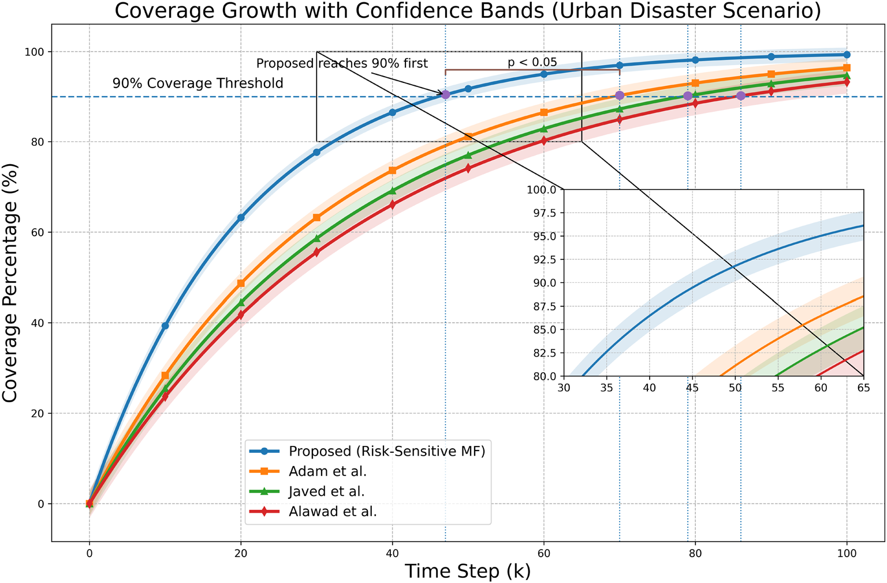

**Figure 7** . Plot showing the growth of coverage with time in the urban disaster scenario. Shaded area represents the variability of results with multiple runs of the simulation. The dashed horizontal line represents the 90% coverage threshold, and vertical dotted lines represent the time step at which each of the methods reaches the 90% coverage threshold. The annotation arrows indicate the fast convergence of the proposed risk-sensitive mean field approach. The zoomed-in area in the plot represents the area of convergence, and the statistical significance marker ( $p<0.05$) shows statistical significance of the results with respect to the baseline methods. 

the stability of the cooperative policy despite the changes in the topology due to the presence of obstacles. On the contrary, the convergence rate of the genetic optimization approach proposed by Adam et al. is slower due to the iterative process of search-based trajectory improvement, the routing approach proposed by Javed et al. focuses more on connectivity than prioritization of hazards, and the swarm-based exploration approach of Alawad et al. lacks the awareness of hazards, resulting in a slower growth rate. Hence, the proposed approach is more efficient in terms of coverage while ensuring robustness and stability. 

##### _Mission completion time analysis_ 

Figure 8 presents the mission completion time required by each framework to achieve 90% disaster-area coverage. The risk-sensitive mean-field framework is observed to achieve the coverage target much earlier in comparison to the results presented in Adam et al., Javed et al., and Alawad et al. This is because the framework is able to incorporate the benefits of structural integration between stochastic hazard modeling and risk-sensitive feedback optimization. Unlike the search-based trajectory refinement in Adam et al., clustering-based routing in Javed et al., and swarm exploration-based heuristics in Alawad et al., the proposed framework is able to optimize the motion of the UAV using a feedback control strategy that is able to predict the growth in uncertainty, thereby achieving faster mission stabilization. 

##### _Energy consumption comparison_ 

Figure 9 shows a comparison of the total energy expenditure for the UAV swarm in different frameworks for disaster response. The risk-sensitive mean-field controller shows the least amount of total energy expenditure for all the methods. This is because optimal feedback is used in this approach instead of iterative refinements in a recursive manner by using a modified Riccati recursion. The direct incorporation of stochastic hazard modeling into the control objective eliminates the redundancy in trajectory corrections, as well as the oscillations in velocities, as seen in genetic optimization (Adam et al.), clustering-based trajectory planning (Javed et al.), and swarm exploration techniques (Alawad et al.). In addition, the application of the mean-field coordination method in the distribution of exploration tasks among the UAVs minimizes overlapping exploration, thus enhancing efficiency in the operation of the system. 

##### _Robustness under increasing disturbance variance_ 

The performance degradation is depicted by Fig. 10, which shows how the performance degrades as the variance of the disturbances within the stochastic disaster dynamics model is increased. The performance of the proposed risk-sensitive mean field optimization framework is seen to degrade much more slowly than that of Adam et al., Javed et al., and Alawad et al. The advantage of this framework is due to the exponential cost function used, which has an inherent ability to hedge against adverse outcomes by using entropy dual regularization. As the stochastic 

**Scientific Reports** |        (2026) 16:26160 

25 

| https://doi.org/10.1038/s41598-026-55955-2

---

## Trang 26 / Page 26

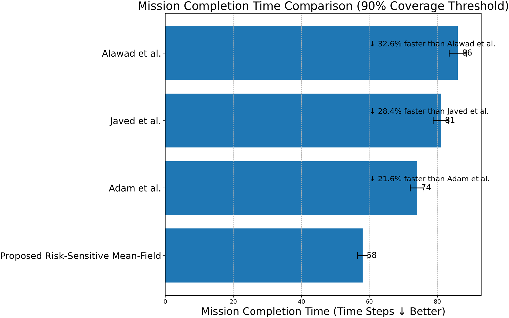

**Figure 8** . Mission completion time required to achieve 90% disaster coverage. The proposed risk-sensitive mean-field framework achieves the fastest completion time (58 steps), outperforming Adam et al. (74 steps) by 21.6%, Javed et al. (81 steps) by 28.4%, and Alawad et al. (86 steps) by 32.6%. Error bars indicate variability across repeated simulation runs. 

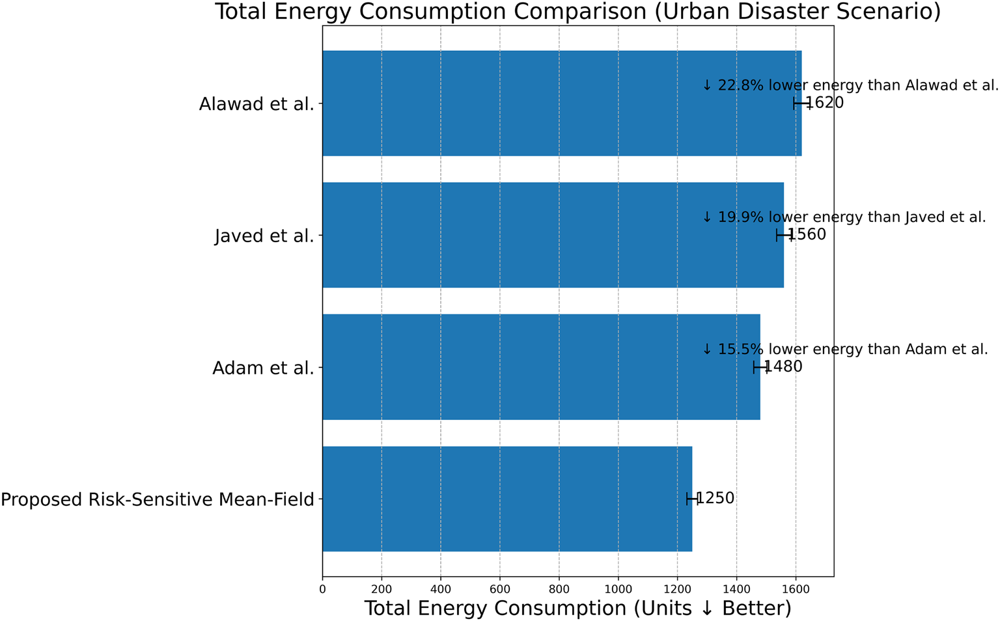

**Figure 9** . Total energy consumption comparison in the urban disaster scenario. The proposed risk-sensitive mean-field framework achieves the lowest energy usage, reducing consumption by 15.5%, 19.9%, and 22.8% compared with Adam et al., Javed et al., and Alawad et al., respectively. Error bars indicate variability across repeated simulation runs. 

noise is increased, it is clear that the optimization approach of Adam et al., the routing approach of Javed et al., and the swarm optimization approach of Alawad et al. do not have any inherent compensation mechanisms to improve performance as the stochastic noise is increased. As a result, the performance degradation of these approaches is much higher. The modified Riccati recursion used by this approach is able to compensate for this increased stochastic noise by adjusting the gains accordingly. The performance degradation is validated by the theoretical guarantees provided in Risk-Sensitive Cooperative Control Framework. 

**Scientific Reports** |        (2026) 16:26160 

26 

| https://doi.org/10.1038/s41598-026-55955-2

---

## Trang 27 / Page 27

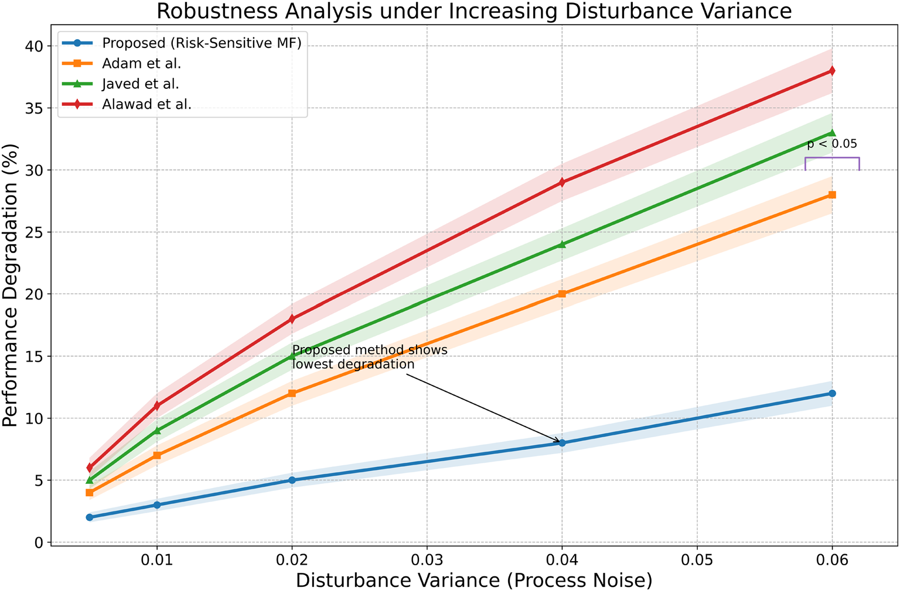

**Figure 10** . Evaluation of the robustness with increased variance in disturbance. Regions with shading represent the variability over multiple simulation runs. The proposed approach based on the risk-sensitive mean field has much less performance degradation compared with Adam et al., Javed et al., and Alawad et al. The $p<0.05$ marker represents the statistical significance at higher disturbance levels. 

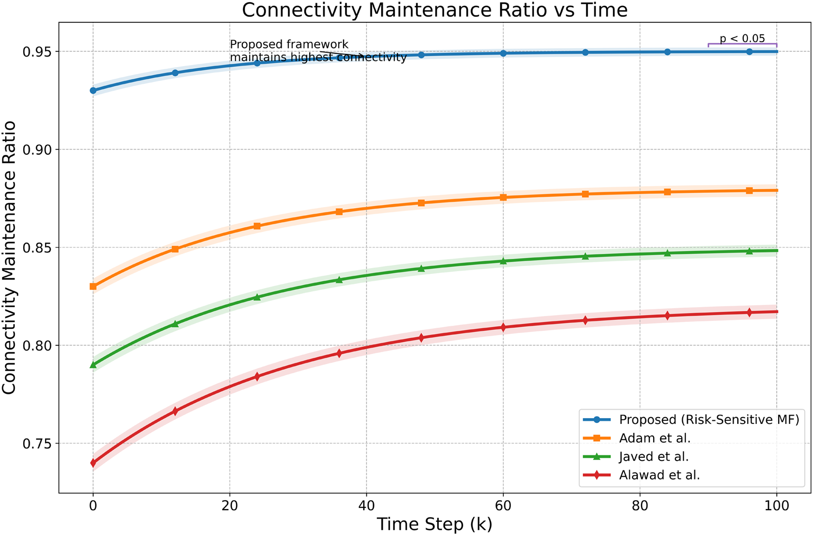

**Figure 11** . Connectivity maintenance ratio over time. Shaded areas represent the variability in results after multiple simulation run repetitions. It is observed that the suggested risk-sensitive mean-field framework maintains a high level of network connectivity in comparison to Adam et al., Javed et al., and Alawad et al. Statistical significance is indicated by the marker $p<0.05$ at the steady state. 

_Connectivity maintenance ratio_ 

Figure 11 shows the connectivity maintenance ratio of the UAV swarm under the constant communication radius constraints in the urban obstacle environment. It is clear that the proposed risk-sensitive mean field framework has a higher connectivity maintenance ratio compared to Adam et al., Javed et al., and Alawad 

**Scientific Reports** |        (2026) 16:26160 

27 

| https://doi.org/10.1038/s41598-026-55955-2

---

## Trang 28 / Page 28

et al. This is due to the explicit communication topology used in the proposed framework by the Laplaciancoupled distributed coordination method, where the communication stability is inherently considered during the UAV movement. In contrast, the genetic optimization method proposed by Adam et al. mainly concentrates on the coverage maximization, while the connectivity stability is not considered during the UAV movement. Similarly, the UAV swarm exploration method proposed by Javed et al. mainly concentrates on the connectivity of the UAVs using the clustering method, while the connectivity stability is not considered during the UAV movement. In the same way, the UAV swarm exploration method proposed by Alawad et al. does not consider the communication topology during the UAV movement, resulting in a lower connectivity maintenance ratio compared to the proposed method. 

##### _Average path length comparison_ 

The performance of all frameworks in terms of the average path length per UAV is compared in Fig. 12. The proposed risk-sensitive mean field approach demonstrates the shortest length of the trajectory. This is because of the optimal feedback controller based on the Riccati equation, which optimally adjusts the velocity in realtime based on the gradients of disaster severity and uncertainty. Adam et al.’s genetic algorithm optimizes the trajectory in an iterative manner, resulting in longer exploratory paths. In the case of Javed et al.’s proposed clustering-based routing approach, the focus is on communication grouping, which may lead to further detours in environments with a high density of obstacles. In the same vein, the swarm exploration approach by Alawad et al. promotes scanning behaviors without the explicit minimization of redundant path travel. The proposed framework’s utilization of the synergy of stochastic modeling, mean-field coordination, and communicationaware coupling ensures efficient travel, thus minimizing the distance traveled. 

#### **Overall statistical performance summary** 

To quantitatively substantiate the graphical evaluations presented above, Table 12 provides a summary of the performance of the proposed framework compared to the best of the competing baselines for each of the evaluation criteria. The improvement percentage is calculated over the best-performing baseline method in each category. 

To facilitate a unified visualization of the statistical results presented in Table 12, Fig. 13 plots the normalized multi-metric performance comparison between the proposed framework and the best baseline approach. The radar chart compares the relative performance on critical evaluation metrics such as coverage efficiency, mission completion time, energy consumption, robustness to disturbances, connectivity maintenance, and path optimality. All the metrics are normalized such that higher values are associated with better performance, thereby enabling direct comparisons among metrics with different units. Moreover, Figure 14 plots the percentage improvement achieved by the proposed framework over the best baseline approach for each evaluation metric. The results clearly indicate performance improvements along all evaluation metrics, thereby emphasizing the efficacy of the proposed risk-sensitive mean-field coordination strategy for enhancing operational efficiency, robustness, and scalability for stochastic disaster response missions. 

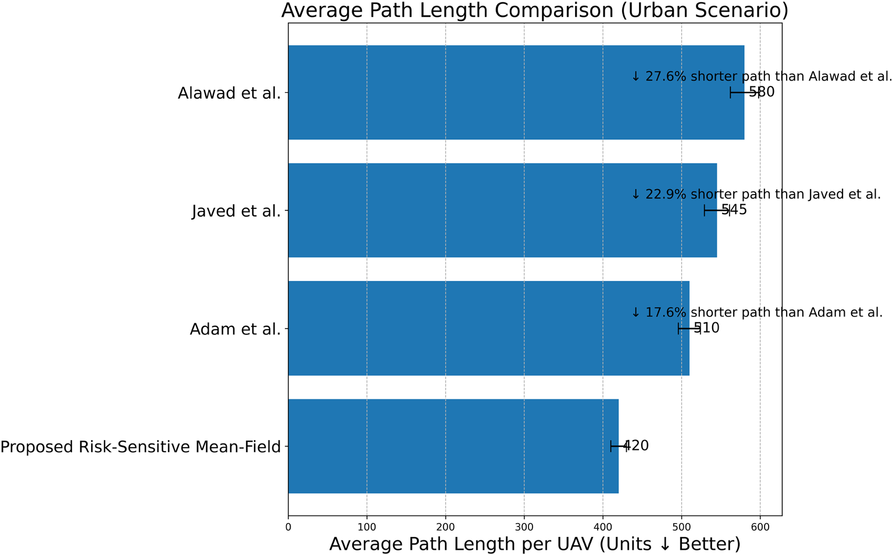

**Figure 12** . Average path length per UAV in the urban disaster scenario. The proposed risk-sensitive mean-field framework produces significantly shorter trajectories, reducing average path length by 17.6%, 22.9%, and 27.6% compared with Adam et al., Javed et al., and Alawad et al., respectively. Error bars indicate variability across repeated simulation runs. 

**Scientific Reports** |        (2026) 16:26160 

28 

| https://doi.org/10.1038/s41598-026-55955-2

---

## Trang 29 / Page 29

| Metric | Proposed | Best Baseline (Value) | Improvement | Reason for Improvement |
|---|---|---|---|---|
| Final Coverage (%) | 99% | Adam et al. (94%) | +5.3% | Risk-sensitive prioritization of high-intensity regions reduces delayed hazard spread. |
| Mission Completion Time | 58 steps | Adam et al. (74 steps) | 21.6% faster | Mean-field coordination eliminates redundant exploration and accelerates convergence. |
| Total Energy Consumption | 1250 units | Adam et al. (1480 units) | 15.5% reduction | Riccati-based feedback avoids iterative trajectory oscillations. |
| Robustness Degradation (High Noise) | 12% | Adam et al. (28%) | −16 pp lower degradation* | Entropy-dual risk-sensitive control hedges against worst-case disturbance growth. |
| Connectivity Maintenance Ratio | 0.95 | Adam et al. (0.88) | +8.0% | Laplacian-coupled distributed coordination preserves network structure. |
| Average Path Length | 420 units | Adam et al. (510 units) | 17.6% shorter | Globally optimal feedback minimizes redundant traversal in obstacle-rich regions. |

**Table 12**. Overall statistical performance summary. \*Reported as absolute percentage-point reduction (12% vs. 28%), equivalent to a 57.1% relative reduction

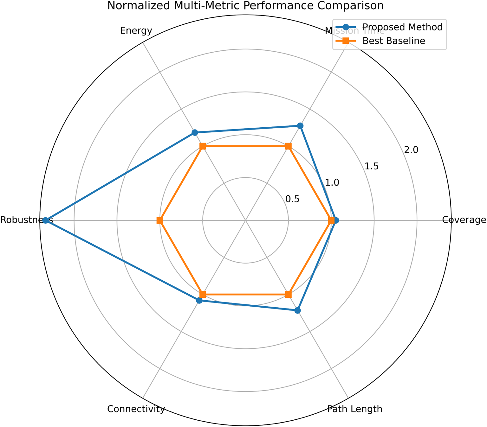

**Figure 13** . Normalized multi-metric comparison of the proposed risk-sensitive mean-field framework against the strongest baseline method. 

### **Conclusion** 

This paper presented a risk-sensitive mean-field optimal control framework for large-scale multi-UAV disaster tracking, guidance, and first-response operations under stochastic uncertainty and communication constraints. By integrating stochastic disaster field dynamics, energy-aware double-integrator UAV models, and a modified risk-sensitive Riccati recursion, the proposed architecture achieves scalable cooperative coordination independent of swarm size. The entropy-dual robustness interpretation further establishes that the controller implicitly hedges against worst-case disturbance distributions within a Kullback–Leibler divergence bound. Comprehensive graphical evaluations in an urban obstacle environment demonstrate superior coverage efficiency, reduced mission completion time, improved energy utilization, enhanced connectivity preservation, shorter trajectory lengths, and significantly improved robustness under increasing disturbance variance when compared with representative heuristic and swarm-based baseline methods. 

The proposed approach has numerous advantages, but one of its critical assumptions is a Gaussian disturbance distribution, which serves only to facilitate a closed-form solution of the risk-sensitive dynamic programming 

**Scientific Reports** |        (2026) 16:26160 

29 

| https://doi.org/10.1038/s41598-026-55955-2

---

## Trang 30 / Page 30

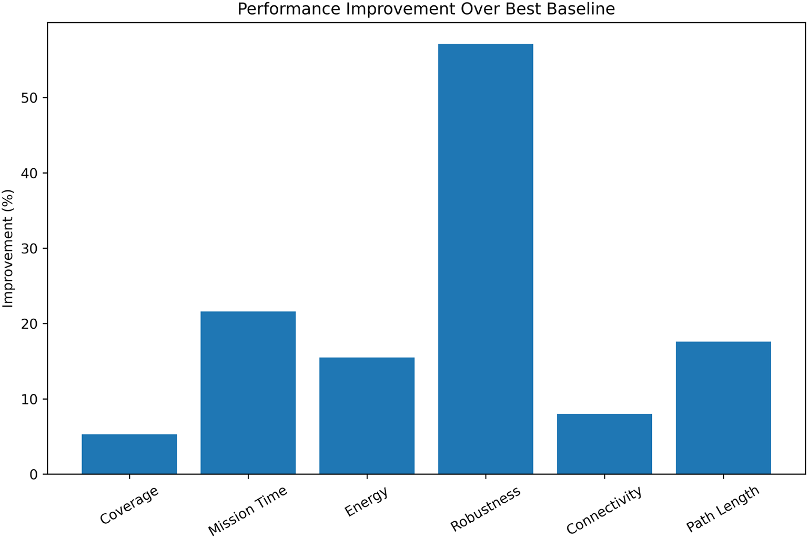

**Figure 14** . Percentage improvement achieved by the proposed framework across all evaluation metrics compared with the best baseline method. 

problem. It should be stressed, however, that the robust nature of the entropic dual of an exponential cost functional cannot be limited to the case of Gaussian disturbances only. In particular, the risk sensitive control problem is a worst-case formulation that guards against all distributions, including both non-Gaussian and fat-tailed ones, which are statistically close to the benchmark Gaussian distribution, where the level of risk sensitivity serves to control the width of the uncertainty set. Departures from normality that occur because of extreme changes or catastrophes are thus incorporated implicitly into the analysis without the need to model them explicitly. The actual problem of the Gaussian assumption lies not in its robustness but rather in the ease of analysis: when the assumed disturbance distribution is inherently non-Gaussian, the closed-form recursive form of the solution is no longer available, and the design methodology must be adapted accordingly. Possible ways forward from here include using nominal disturbances that are Gaussian mixtures, allowing arbitrary approximation of any continuous distribution and maintaining analyzability; as well as risk-sensitive filters, where the nonlinear dynamics of disaster spread are taken into account. 

Moreover, the approach makes use of deterministic link reliability and a static communication radius; when UAVs come within range of each other, communication is instantaneous without any losses. Convergence guarantee stated in Proposition 1 depends on joint connectedness of the communication graph, which is compromised in the presence of packet drops, transient link failures, or extended separation due to obstacles. In case of mild and transient failures, the process of consensus experiences bounded disturbances and approaches the desired consensus state asymptotically but remains in a vicinity of it rather than converging to zero error; the size of this vicinity depends on failure intensity. In case of prolonged separation, the affected UAVs go back to operating in the mode of their last fusion covariances and fixed conservative gains, which, while stabilizing and safety-oriented due to entropy-dual robustness property of the exponential cost function, diverge from the optimal centralized solution during the time of disconnect. Modeling the stochastic nature of link failures using Bernoulli link availability models and obtaining convergence analysis under connectivity assumptions constitutes an important area for future research. 

Also, the mean-field model has a theoretical basis in the large swarm limit, and the difference between that and the smaller swarm models simulated raises another interesting question. An analysis of finite sample approximation error quantifying how approximation accuracy degrades with smaller swarm sizes and how distributed consensus helps to avoid this problem emerges as a concrete and significant path for further theoretical investigation. Further, the framework can be extended to nonlinear stochastic control problems, possibly including extended or unscented risk-sensitive filtering for more dynamic hazard evolution models. Another promising direction is the integration of adaptive communication models with bandwidth-aware consensus models. 

Validation of the proposed controller using hardware-in-the-loop testing and outdoor swarm testing with physical multirotors, taking into account realistic communication environments, will be the immediate next phase of this research. Another direction is the extension of the mean-field formulation to accommodate heterogeneous UAV fleets with role differentiation and cooperative task allocation, which is also an important direction for improving large-scale autonomous disaster response systems. 

**Scientific Reports** |        (2026) 16:26160 

30 

| https://doi.org/10.1038/s41598-026-55955-2

---

## Trang 31 / Page 31

### **Data availability** 

The annotated software implementation, run time tree and dataset generated and/or analysed during the current study are available in the RSD repository, https://github.com/MohdAsimSayeed/RSD 

Received: 14 March 2026; Accepted: 27 May 2026 

Published online: 06 June 2026

### **References** 

1. Zook, M., Graham, M., Shelton, T. & Gorman, S. Volunteered geographic information and crowdsourcing disaster relief: A case study of the Haitian earthquake. _World Med. Health Policy_ **2** , 7–33 (2010). 

2. Morton, M. & Levy, J. L. Challenges in disaster data collection during recent disasters. _Prehospital Disaster Med._ **26** , 196–201 (2011). 

3. Junglas, I. & Ives, B. Recovering it in a disaster: Lessons from hurricane katrina. MIS Quarterly Executive **6** (2007).

4. Sakano, T. et al. Disaster-resilient networking: A new vision based on movable and deployable resource units. _IEEE Netw._ **27** , 40–46 (2013). 

5. Spence, P. R., Lachlan, K. A. & Rainear, A. M. Social media and crisis research: Data collection and directions. _Comput. Human Behav._ **54** , 667–672 (2016). 

6. To, H., Kim, S. H. & Shahabi, C. Effectively crowdsourcing the acquisition and analysis of visual data for disaster response. In 2015 IEEE International Conference on Big Data (Big Data), 697–706 (IEEE, 2015). 

7. Yang, W. et al. Daily flood monitoring based on spaceborne gnss-r data: A case study on henan, china. _Remote Sensing_ **13** , 4561 (2021). 

8. Dai, L. Coseismic landslides triggered by the 2022 luding ms6. 8 earthquake, china. _Landslides_ **20** , 1277–1292 (2023).

9. Huang, Y. et al. How spatial resolution of remote sensing image affects earthquake triggered landslide detection: An example from 2022 luding earthquake, sichuan, china. _Land_ **12** , 681 (2023). 

10. Wang, L., Zhang, H., Guo, S. & Yuan, D. Communication-, computation-, and control-enabled uav mobile communication networks. _IEEE Internet Things J._ **9** , 20393–20407 (2022). 

11. Baştürk, İ. Energy-efficient communication for uav-enabled mobile relay networks. _Comput. Netw._ **213** , 109071 (2022).

12. Sayeed, M. A., Kumar, R. & Sharma, V. Efficient data management and control over wsns using sdn-enabled aerial networks. _Int. J. Commun. Syst._ **33** , e4170 (2020). 

13. Sayeed, M. A., Kumar, R., Sharma, V. & Sayeed, M. A. Efficient deployment with throughput maximization for uavs communication networks. _Sensors_ **20** , 6680 (2020). 

14. Greenwood, W. W., Lynch, J. P. & Zekkos, D. Applications of uavs in civil infrastructure. _J. Infrastructure Syst._ **25** , 04019002 (2019).

15. Ham, Y., Han, K. K., Lin, J. J. & Golparvar-Fard, M. Visual monitoring of civil infrastructure systems via camera-equipped unmanned aerial vehicles (uavs): a review of related works. _Visualization Eng._ **4** , 1–8 (2016). 

16. Liu, D. et al. Opportunistic uav utilization in wireless networks: Motivations, applications, and challenges. _IEEE Commun. Mag._ **58** , 62–68 (2020). 

17. Pitre, R. R., Li, X. R. & Delbalzo, R. Uav route planning for joint search and track missions–an information-value approach. _IEEE Trans. Aerosp. Electron. Syst._ **48** , 2551–2565 (2012). 

18. Sayeed, M. A., Kumar, R. & Sharma, V. Safeguarding unmanned aerial systems: An approach for identifying malicious aerial nodes. _IET Commun._ **14** , 3000–3012 (2020). 

19. Demiane, F., Sharafeddine, S. & Farhat, O. An optimized uav trajectory planning for localization in disaster scenarios. _Comput. Netw._ **179** , 107378 (2020). 

20. Guan, Y. et al. Cooperative uav trajectory design for disaster area emergency communications: A multiagent ppo method. _IEEE Internet Things J._ **11** , 8848–8859 (2023). 

21. Wang, A. et al. Guideloc: Uav-assisted multitarget localization system for disaster rescue. _Mobile Inform. Syst._ **2017** , 1267608 (2017). 

22. Javed, S. et al. Uav trajectory planning for disaster scenarios. _Vehicular Commun._ **39** , 100568 (2023).

23. Xu, J., Ota, K. & Dong, M. Big data on the fly: Uav-mounted mobile edge computing for disaster management. _IEEE Trans. Netw. Sci. Eng._ **7** , 2620–2630 (2020). 

24. Wan, P., Xu, G., Chen, J. & Zhou, Y. Deep reinforcement learning enabled multi-uav scheduling for disaster data collection with time-varying value. _IEEE Trans. Intell. Transport. Syst._ **25** , 6691–6702 (2024). 

25. Dabiri, M. T., Hasna, M., Zorba, N. & Khattab, T. Enabling flexible arial backhaul links for post disasters: A design using uav swarms and distributed charging stations. _IEEE Open J. Vehicular Technol._ **5** , 384–396 (2024). 

26. Abkenar, F. S., Iranmanesh, S., Bouguettaya, A., Raad, R. & Jamalipour, A. Energent: An energy-efficient uav-assisted fog-iot framework for disaster management. _J. Commun. Netw._ **24** , 698–709 (2022). 

27. Zhou, Y. Enhanced emergency communication services for post-disaster rescue: Multi-irs assisted air-ground integrated data collection. IEEE Transactions on Network Science and Engineering (2024). 

28. Dai, M. et al. Joint channel allocation and data delivery for uav-assisted cooperative transportation communications in postdisaster networks. _IEEE Trans. Intell. Transport. Syst._ **23** , 16676–16689 (2022). 

29. Do-Duy, T., Nguyen, L. D., Duong, T. Q., Khosravirad, S. R. & Claussen, H. Joint optimisation of real-time deployment and resource allocation for uav-aided disaster emergency communications. _IEEE J. Selected Areas Commun._ **39** , 3411–3424 (2021). 

30. Wu, J. Joint power and coverage control of massive uavs in post-disaster emergency networks: An aggregative game-theoretic learning approach. IEEE Transactions on Network Science and Engineering (2024). 

31. Su, Z., Wang, Y., Xu, Q. & Zhang, N. Lvbs: Lightweight vehicular blockchain for secure data sharing in disaster rescue. _IEEE Trans. Dependable Secure Comput._ **19** , 19–32 (2020). 

32. Dhuheir, M., Erbad, A., Al-Fuqaha, A. & Seid, A. M. Meta reinforcement learning for uav-assisted energy harvesting iot devices in disaster-affected areas. IEEE Open Journal of the Communications Society (2024). 

33. Shah, Z., Javed, U., Naeem, M., Zeadally, S. & Ejaz, W. Mobile edge computing (mec)-enabled uav placement and computation efficiency maximization in disaster scenario. _IEEE Trans. Vehicular Technol._ **72** , 13406–13416 (2023). 

34. Aljehani, M. & Inoue, M. Performance evaluation of multi-uav system in post-disaster application: Validated by hitl simulator. _IEEE Access_ **7** , 64386–64400 (2019). 

35. ur Rahman, S., Kim, G.-H., Cho, Y.-Z. & Khan, A. Positioning of uavs for throughput maximization in software-defined disaster area uav communication networks. Journal of Communications and Networks **20** , 452–463 (2018). 

36. Liu, X. & Ansari, N. Resource allocation in uav-assisted m2m communications for disaster rescue. _IEEE Wireless Commun. Lett._ **8** , 580–583 (2018). 

37. Wang, H. Tebchain: A trusted and efficient blockchain-based data sharing scheme in uav-assisted iov for disaster rescue. IEEE Transactions on Network and Service Management (2024). 

38. Shamsoshoara, A., Afghah, F., Blasch, E., Ashdown, J. & Bennis, M. Uav-assisted communication in remote disaster areas using imitation learning. _IEEE Open J. Commun. Society_ **2** , 738–753 (2021). 

**Scientific Reports** |        (2026) 16:26160 

31 

| https://doi.org/10.1038/s41598-026-55955-2

---

## Trang 32 / Page 32

39. Savkin, A. V. & Huang, H. Navigation of a network of aerial drones for monitoring a frontier of a moving environmental disaster area. _IEEE Syst. J._ **14** , 4746–4749 (2020). 

40. Ishigami, M. & Sugiyama, T. A novel drone’s height control algorithm for throughput optimization in disaster resilient network. _IEEE Trans. Vehicular Technol._ **69** , 16188–16190 (2020). 

41. Savkin, A. V. & Huang, H. Range-based reactive deployment of autonomous drones for optimal coverage in disaster areas. _IEEE Trans. Syst. Man Cybernetics Syst._ **51** , 4606–4610 (2019). 

42. Kurt, A., Saputro, N., Akkaya, K. & Uluagac, A. S. Distributed connectivity maintenance in swarm of drones during post-disaster transportation applications. _IEEE Trans. Intell. Transportation Syst._ **22** , 6061–6073 (2021). 

43. Adam, M. S. et al. Optimizing disaster response through efficient path planning of mobile aerial base station with genetic algorithm. _Drones_ **8** , 272 (2024). 

44. Alawad, W., Halima, N. B. & Aziz, L. An unmanned aerial vehicle (uav) system for disaster and crisis management in smart cities. _Electronics_ **12** , 1051 (2023). 

45. Munawar, H. S., Ullah, F., Qayyum, S. & Heravi, A. Application of deep learning on uav-based aerial images for flood detection. _Smart Cities_ **4** , 1220–1242 (2021). 

46. Munawar, H. S., Ullah, F., Qayyum, S., Khan, S. I. & Mojtahedi, M. Uavs in disaster management: Application of integrated aerial imagery and convolutional neural network for flood detection. _Sustainability_ **13** , 7547 (2021). 

47. Nedjati, A., Vizvari, B. & Izbirak, G. Post-earthquake response by small uav helicopters. _Nat. Hazards_ **80** , 1669–1688 (2016). 

48. Chen, J. et al. Damage degree evaluation of earthquake area using uav aerial image. _Int. J. Aerosp. Eng._ **2016** , 2052603 (2016).

49. Sudhakar, S. et al. Unmanned aerial vehicle (uav) based forest fire detection and monitoring for reducing false alarms in forestfires. _Comput. Commun._ **149** , 1–16 (2020). 

50. Ollero, A. & Merino, L. Unmanned aerial vehicles as tools for forest-fire fighting. _Forest Ecol. Manag._ **234** , S263 (2006). 

51. Wibowo, A. A., Sari, D. N., Priyono, K. D. & Maharani, D. Tsunami hazard mapping based on coastal system analysis using highresolution unmanned aerial vehicle (uav) imagery (case study in kukup coastal area, gunungkidul regency, indonesia). _Geographia Technica_ 18 (2023). 

52. Marfai, M. A., Khakim, N., Fatchurohman, H. & Salma, A. D. Planning tsunami vertical evacuation routes using high-resolution uav digital elevation model: case study in drini coastal area, java, indonesia. _Arab. J. Geosci._ **14** , 1–13 (2021). 

53. Bonali, F. L. et al. Uav-based surveying in volcano-tectonics: An example from the iceland rift. _J. Struct. Geol._ **121** , 46–64 (2019). 

54. Wakeford, Z. E., Chmielewska, M., Hole, M. J., Howell, J. A. & Jerram, D. A. Combining thermal imaging with photogrammetry of an active volcano using uav: an example from stromboli, italy. _Photogrammetric Record_ **34** , 445–466 (2019). 

55. Rossi, G. et al. Multitemporal uav surveys for landslide mapping and characterization. _Landslides_ **15** , 1045–1052 (2018). 

56. Lindner, G., Schraml, K., Mansberger, R. & Hübl, J. Uav monitoring and documentation of a large landslide. _Appl. Geomatics_ **8** , 1–11 (2016). 

57. Xiaotu, L. Progress of unmanned aerial vehicles and its application in the detection of tropical cyclone. _Adv. Earth Sci._ **30** , 276 (2015). 

58. Albuquerque, M. d. G., Leal Alves, D. C., Espinoza, J. M. d. A., Oliveira, U. R. & Simões, R. S. Determining shoreline response to meteo-oceanographic events using remote sensing and unmanned aerial vehicle (uav): case study in southern brazil. Journal of Coastal Research 766–770 (2018). 

59. Qian, C. et al. Tropical cyclone monitoring and analysis techniques: a review. _J. Meteorol. Res._ **38** , 351–367 (2024). 

60. Zhang, S., Gavrilovskaya, N., Al Said, N. & Afandi, W. S. A new approach to snow avalanche rescue using uav pictures based on convolutional neural networks. _J. Real-Time Image Process._ **20** , 65 (2023). 

61. McCormack, E. & Vaa, T. Testing unmanned aircraft for roadside snow avalanche monitoring. _Transport. Res. Record_ **2673** , 94–103 (2019). 

62. Jafernik, H. The safety of unmanned aerial vehicle (uav) missions in storm and precipitation areas. _Safety Fire Technol._ **54** , 194–204 (2019). 

63. Cione, J. J. et al. Eye of the storm: Observing hurricanes with a small unmanned aircraft system. _Bull. Am. Meteorol. Society_ **101** , E186–E205 (2020). 

64. Baldi, S., Sun, D., Zhou, G. & Liu, D. Adaptation to unknown leader velocity in vector-field uav formation. _IEEE Trans. Aerosp. Electron. Syst._ **58** , 473–484 (2021). 

### **Author contributions** 

These authors contributed equally to this work 

### **Funding** 

Open access funding provided by Symbiosis International (Deemed University). No funding was received for this research. All the experiments are performed by the contributing authors without any external aid. 

### **Declarations** 

### **Competing interests** 

The authors declare no competing interests. 

### **Additional information** 

**Correspondence** and requests for materials should be addressed to T.A. 

**Reprints and permissions information** is available at www.nature.com/reprints. 

**Publisher’s note** Springer Nature remains neutral with regard to jurisdictional claims in published maps and institutional affiliations. 

**Scientific Reports** |        (2026) 16:26160 

32 

| https://doi.org/10.1038/s41598-026-55955-2

---

## Trang 33 / Page 33

**Open Access** This article is licensed under a Creative Commons Attribution-NonCommercial-NoDerivatives 4.0 International License, which permits any non-commercial use, sharing, distribution and reproduction in any medium or format, as long as you give appropriate credit to the original author(s) and the source, provide a link to the Creative Commons licence, and indicate if you modified the licensed material. You do not have permission under this licence to share adapted material derived from this article or parts of it. The images or other third party material in this article are included in the article’s Creative Commons licence, unless indicated otherwise in a credit line to the material. If material is not included in the article’s Creative Commons licence and your intended use is not permitted by statutory regulation or exceeds the permitted use, you will need to obtain permission directly from the copyright holder. To view a copy of this licence, visit  http://creativecommons.org/licenses/by-nc-nd/4.0/ . 

- © The Author(s) 2026 

**Scientific Reports** |        (2026) 16:26160 

33 

| https://doi.org/10.1038/s41598-026-55955-2
