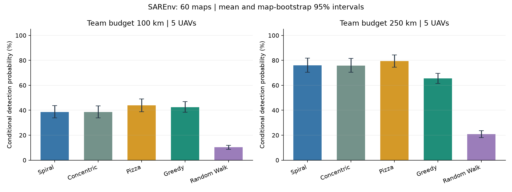
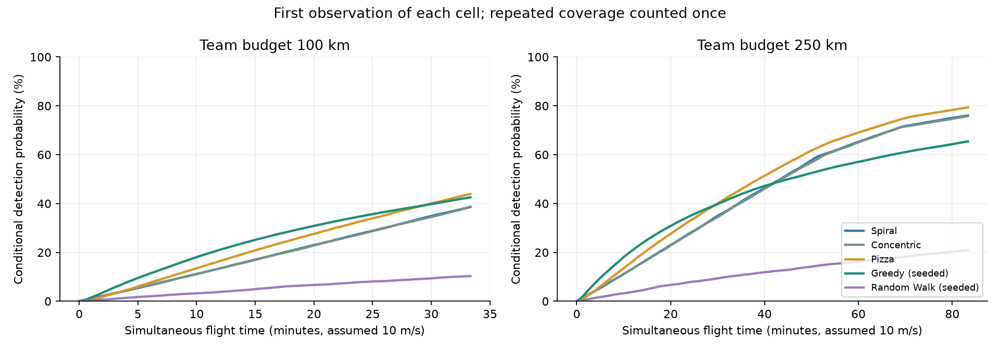
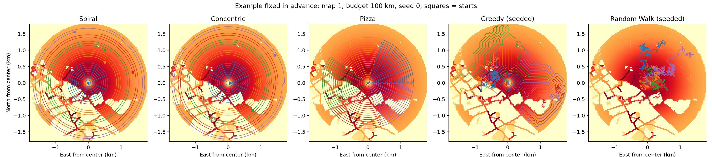

# Báo cáo baseline multi-UAV SAR trên benchmark SAREnv

**Kết quả chạy thực tế trên CPU; không dùng GPU, không huấn luyện mô hình ảnh.**
Lần chạy bắt đầu: `2026-09-28T16:53:38.604896+00:00`. Hoàn tất: `2026-09-28T16:55:54.569333+00:00`.

## 1. Mục tiêu và phạm vi

Cài đặt và đánh giá các baseline điều phối tìm kiếm cho đội 5 UAV trên **60 bản đồ đã công bố của SAREnv**.
Chúng tôi sử dụng bản đồ xác suất vị trí người mất tích gốc và quy ước vùng phủ camera của benchmark.
Đây là tái lập baseline trên dữ liệu công bố, chưa phải thuật toán GA/NSGA-II mới hay thực nghiệm UAV ngoài đời.

**Phân biệt p và q:** SAREnv cung cấp prior vị trí không đồng nhất p(x). Trong phép đánh giá này, q=1 khi ô nằm trong vùng nhìn và q=0 ngoài vùng nhìn. Dataset không cung cấp xác suất nhận diện theo hover time.
Vì vậy kết quả này là mốc cơ sở cho đề tài; chưa kiểm chứng mô hình q(x,h) không đồng nhất, hover, che khuất hoặc camera học sâu.

## 2. Nguồn, phiên bản và xử lý dữ liệu

- Paper: [Grøntved và cộng sự (2025), Drones 9(9), 628](https://doi.org/10.3390/drones9090628).
- Dataset/code tác giả: [namurproject/SAREnv](https://github.com/namurproject/SAREnv).
- Bản lưu dataset của trường: [SAREnv v1.0, University of Bristol](https://doi.org/10.5523/bris.2k50yyk57qlrj27r4abckbrsfr). Lần chạy này dùng snapshot GitHub đã ghim, không khẳng định bytes giống bản lưu Bristol.

Commit cố định: `0f2d344d17c0b9c18cec2176dd9b171beba727d6`.
Map IDs: `1,2,3,4,5,6,7,8,9,10,11,12,13,14,15,16,17,18,19,20,21,22,23,24,25,26,27,28,29,30,31,32,33,34,35,36,37,38,39,40,41,42,43,44,45,46,47,48,49,50,51,52,53,54,55,56,57,58,59,60`. Kích thước: `medium`.

60 bản đồ của bộ gốc chia thành bốn nhóm: 1–15 đồng bằng/ôn đới, 16–30 miền núi/ôn đới, 31–45 đồng bằng/khô, 46–60 miền núi/khô.
Chúng là bản đồ địa lý kết hợp mô hình xác suất hành vi người mất tích, không phải 60 vụ cứu hộ có vị trí nạn nhân được quan trắc thực tế.
Không chọn bản đồ theo kết quả thuật toán; cấu hình đã được ghi trước khi chạy.

Tải nguyên file `heatmap.npy`, kiểm tra Git blob SHA-1 từ cây repository đã ghim và lưu SHA-256 riêng.
Chỉ trích metadata cuối GeoJSON qua HTTP Range với ETag khớp LFS SHA-256; lưu bytes trích và manifest. Không tải toàn bộ geometry OSM vì các chỉ số ở đây không cần geometry.
Loader cắt hình tròn theo đúng công thức và cách làm tròn của mã gốc, độ phân giải danh nghĩa 30 m/ô. Không giảm độ phân giải.
**Không chuẩn hóa lại crop đầu vào**: khối lượng của vùng medium là một phần của bản đồ master.
Không có training/test split học máy vì đây là đánh giá planner không huấn luyện; các bản đồ dùng để đánh giá với tham số cố định.

## 3. Baseline và thông số

| Baseline | Cách hoạt động | Tính ngẫu nhiên |
|---|---|---|
| Spiral | Xoắn ốc Archimedes, chia đường thành các đoạn bằng độ dài cho đội UAV | Không |
| Concentric | Các vòng tròn đồng tâm nối tiếp, chia đều độ dài | Không |
| Pizza | Mỗi UAV quét một sector hình quạt theo vòng cung zigzag | Không |
| GreedySeeded | Mỗi bước chọn 1 trong 8 ô lân cận có tổng prior chưa quan sát lớn nhất; chia sẻ tập ô đã quan sát giữa UAV | Random khi mọi lựa chọn có gain bằng 0 |
| RandomWalkSeeded | Cùng cơ chế chuyển động và giới hạn của Greedy, chọn ngẫu nhiên láng giềng | Có |

Mã hình học được thích nghi từ SAREnv dưới MIT, giữ attribution tại `reference/LICENSE`.
Greedy giữ quy tắc myopic của upstream, bổ sung RNG có seed và cache footprint. Không xem baseline này là thuật toán mới.
Mỗi kế hoạch trả về tuyến của toàn đội. Chạy tham lam theo vòng lần lượt các UAV như upstream, không giải tối ưu toàn cục.

| Tham số | Giá trị |
|---|---|
| Số UAV | 5 |
| Ngân sách tổng chiều dài đội | 100.0 km, 250.0 km |
| Ngân sách mỗi UAV | 20.0 km, 50.0 km |
| Độ cao / FoV | 80.0 m / 45.0° |
| Bán kính nhìn | khoảng 33,14 m |
| Overlap / waypoint spacing | 0.0 / 10.0 m |
| Mẫu đánh giá dọc đường | không quá 15 m |
| Discount upstream | 0.999 theo mét |
| Seed stochastic | [0, 1, 2, 3, 4] |
| Số lần chạy | 1560 |

Giữ nguyên quy ước benchmark: các UAV được đặt tại điểm đầu mỗi đoạn, không tính chi phí triển khai từ cùng depot, không bắt buộc quay về, không có tránh va chạm, pin vật lý, độ dốc bay hay vùng cấm.
Spiral/Concentric có thể bắt đầu ở xa tâm; đây là giới hạn cần giữ trong diễn giải kết quả.
Vận tốc 10.0 m/s chỉ là giả định của chỉ số thời gian bổ sung; không ảnh hưởng likelihood gốc.

## 4. Định nghĩa các chỉ số

- **Likelihood mass gốc:** L = tổng p_i trên hợp các ô đã nhìn thấy. Một ô chỉ tính một lần giữa tất cả UAV. So sánh được với cột `Likelihood Score` của repository.
- **Q cuối có điều kiện:** Q = L / M, với M là tổng prior trong crop medium. Diễn giải là xác suất phát hiện nếu người ở trong vùng medium. Không được so trực tiếp Q (%) với raw L hoặc cột `Victims Found (%)` gốc.
- **AUC phát hiện:** tích phân Q(t)/H trong [0,H], tính theo lần đầu từng ô được quan sát; UAV bay đồng thời. AUC cao nghĩa là tìm thấy nhiều khối lượng xác suất sớm hơn.
- **Thời gian phát hiện chặn tại H:** nếu không tìm thấy, tính H; bằng H×(1−AUC). Tránh việc chỉ tính thời gian trên các mục tiêu dễ đã tìm thấy.
- **Upstream discounted score:** giữ đúng mã gốc để đối chiếu: cộng khối lượng nhìn thấy tại mọi mẫu, kể cả lặp lại, discount theo khoảng cách cộng dồn từng UAV. **Không phải xác suất, không phải thời gian thực của đội bay đồng thời.**
- `simultaneous_first_observation_discounted_mass` là chỉ số bổ sung tách biệt, chỉ tính quan sát đầu tiên và dùng khoảng cách riêng mỗi UAV.
- Tổng đường bay, diện tích hợp buffer camera, thời gian planner và evaluator được lưu trong CSV. Diện tích buffer theo upstream có thể gồm phần ngoài vòng tìm kiếm; Q chỉ tính prior trong crop.

Không lấy mẫu nạn nhân ẩn để tính `Victims Found (%)` như mã gốc: metric chính được tính trực tiếp trên bản đồ prior, không có nhiễu Monte Carlo. Chúng tôi không gán nhãn metric thay thế thành kết quả victim sampler của tác giả.

## 5. Kết quả thực nghiệm

Trong mỗi bản đồ, lấy trung bình các seed trước. Sau đó lấy trung bình đều giữa bản đồ, tránh tăng trọng số của phương pháp chạy nhiều seed.
95% CI là percentile bootstrap 10000 lần **theo bản đồ**, seed 20260928; thể hiện biến động giữa các kịch bản trong tập benchmark, không chứng minh khả năng tổng quát ngoài đời.

### Ngân sách tổng đội 100 km

| Baseline | Q cuối (%) | 95% CI | AUC (%) | Lập kế hoạch (s) |
|---|---:|---:|---:|---:|
| Spiral | 38.68 | [33.97; 43.63] | 19.10 | 0.060 |
| Concentric | 38.54 | [33.86; 43.50] | 19.02 | 0.067 |
| Pizza | 43.88 | [38.83; 49.12] | 22.46 | 0.021 |
| Greedy (seeded) | 42.53 | [38.41; 46.84] | 25.01 | 0.031 |
| Random Walk (seeded) | 10.32 | [8.74; 11.97] | 5.39 | 0.013 |

### Ngân sách tổng đội 250 km

| Baseline | Q cuối (%) | 95% CI | AUC (%) | Lập kế hoạch (s) |
|---|---:|---:|---:|---:|
| Spiral | 76.05 | [70.52; 81.79] | 44.75 | 0.060 |
| Concentric | 75.83 | [70.35; 81.53] | 44.52 | 0.068 |
| Pizza | 79.36 | [74.41; 84.39] | 48.48 | 0.020 |
| Greedy (seeded) | 65.44 | [61.46; 69.55] | 43.39 | 0.070 |
| Random Walk (seeded) | 20.83 | [18.13; 23.60] | 11.64 | 0.032 |

- Ngân sách đội 100 km: **Pizza** có Q cuối trung bình cao nhất (43.88%). Greedy so với Pizza: -1.35 điểm phần trăm, CI [-3.28; +0.59], tốt hơn trên 25/60 bản đồ.
- Ngân sách đội 250 km: **Pizza** có Q cuối trung bình cao nhất (79.36%). Greedy so với Pizza: -13.92 điểm phần trăm, CI [-16.51; -11.44], tốt hơn trên 3/60 bản đồ.

CI của chênh lệch được bootstrap theo **cặp cùng bản đồ** sau khi trung bình seed. Không kết luận Greedy luôn tốt hơn phương pháp quét đều; các kết luận trên chỉ áp dụng cấu hình đã chạy.







## 6. Tái lập và đối chiếu mã gốc

Đã đối chiếu 177 cặp kết quả deterministic tại 5 UAV, budget 100 km với file CSV upstream; sai lệch likelihood tuyệt đối lớn nhất **2.226e-03**.
Bảng chi tiết: `upstream_comparison.csv`. Đây là đối chiếu các baseline/metric cụ thể, không tuyên bố tái lập toàn bộ paper.
Greedy/Random Walk không kỳ vọng khớp từng số CSV gốc do mã gốc dùng RNG không có seed; bản này công bố 5 seed.

Các kiểm tra tự động gồm: geometry khớp upstream cho 1/5 UAV; evaluator khớp likelihood/discount/area/path length upstream; crop khớp loader gốc; không cộng đôi vùng chồng lấn; tính bất biến khi đổi thứ tự danh sách UAV cho metric đồng thời; đường cong xác suất không giảm; giới hạn đường bay; tái lập seed; trường hợp không quan sát; checksum mã tham chiếu.
Kết quả test lưu ở `../test-results.txt` (chạy lệnh pytest để kiểm tra lại).

## 7. Phần cứng và chi phí tính toán

- CPU: `Apple M4 Pro`; nền tảng `macOS-27.0-arm64-arm-64bit`.
- Python `3.12.13`, NumPy `2.5.3`, Shapely `2.1.2`.
- 6 worker processes, không sử dụng GPU.
- Wall-clock cho cả vòng chạy: **135.96 giây**; không bao gồm tải dữ liệu, cài dependency, sinh báo cáo và test.
- Thời gian mỗi planner là thời gian tường đo trong môi trường có worker song song; không dùng làm benchmark tốc độ phần cứng độc lập.
- Phiên bản dependency chính xác tại `../../requirements-lock.txt`; source hashes, checksum từng map, thời gian và cấu hình tại `manifest.json`.

## 8. Chạy lại

Từ thư mục `uav-sar-baseline`:

```bash
python3.12 -m venv .venv
.venv/bin/python -m pip install -r requirements-lock.txt
.venv/bin/python -m sar_baseline.download --ids 1-60
.venv/bin/python -m pytest -q
.venv/bin/python -m sar_baseline.run --config configs/benchmark.json --workers 6 --output results/reproduce
.venv/bin/python -m sar_baseline.summarize --results results/reproduce
```

Đổi `--output` để bảo toàn kết quả cũ. Chạy nhanh: thêm `--ids 1,16,31,46` cho lệnh run.
`runs.csv` chứa từng lần chạy; `summary.csv` chứa trung bình/CI; `paired_vs_pizza.csv` chứa so sánh theo cặp; `curves.json` chứa đường cong; `routes/` chứa mọi tuyến bay.

## 9. Liên hệ đề tài môn học

Baseline này cung cấp dữ liệu, quy trình đánh giá và mốc so sánh trước khi áp dụng GA/NSGA-II trong Chương 2 và 10.
Phần tiếp theo có thể giữ các prior này nhưng thêm q_i(h), hover và chi phí quay về, rồi tối ưu phân công–thứ tự–thời gian quan sát.
Khi đổi các giả định đó phải tạo protocol riêng, chạy lại **tất cả** baseline với cùng ngân sách và không so trực tiếp bảng mới với bảng native này.
Không lấy prior p_i từ SAREnv làm xác suất phát hiện q_i, không coi chưa quan sát là chắc chắn không có người, không diễn giải độ phủ thành số người được cứu thực tế.

## 10. Kiểm tra sâu khác biệt với CSV upstream


Có **171/177** cặp kết quả hình học khớp CSV lưu sẵn với sai số dưới 1e-10.
Các bản đồ có chênh lệch CSV là **[15, 49]**. Những ID thiếu trong CSV lưu sẵn là **[60]**; chúng vẫn được đánh giá trong thực nghiệm này.

Đã chạy lại trực tiếp loader, ba planner hình học và evaluator **nguyên bản ở cùng commit đã ghim** trên các map khác biệt.
Crop trùng hoàn toàn; sai lệch likelihood lớn nhất giữa mã cài đặt và mã upstream vừa chạy là **1.693e-15**.
Do đó không có bằng chứng về sai khác implementation ở những trường hợp đã kiểm tra; kết quả của snapshot hiện tại khác CSV lưu trước.
**Chưa xác định nguyên nhân lịch sử khiến CSV khác snapshot**; không khẳng định lỗi của tác giả, không tự thay số đo để khớp CSV.
File kiểm chứng: `native_snapshot_audit.json`.

Có thể tái lập phụ lục sau lệnh sinh báo cáo:

```bash
.venv/bin/python -m sar_baseline.audit --results results/reproduce
```

Lưu ý diễn giải: tại 100 km, CI chênh lệch Q cuối giữa Greedy và Pizza chứa 0, nên chưa có kết luận rõ về ưu thế Q cuối theo bootstrap này.
Greedy có AUC trung bình cao hơn ở 100 km (tìm được nhiều prior sớm hơn), trong khi Pizza có Q cuối trung bình cao hơn. Đây là hai tiêu chí khác nhau.
